# FUTURE STARS ACADEMY
## Building Africa's Next Generation of Innovators

---

**Prepared by:** Moshoeshoe Koali and Halieo Matsepe (Founders)
**Location:** Maseru, Lesotho
**Document Type:** Investment-Grade Business Proposal
**Funding Requested:** M300,000
**Founder Contribution:** ~M230,500 (Existing Assets, Equipment, IP)
**Total Project Value:** M530,500
**Date:** July 2026

---

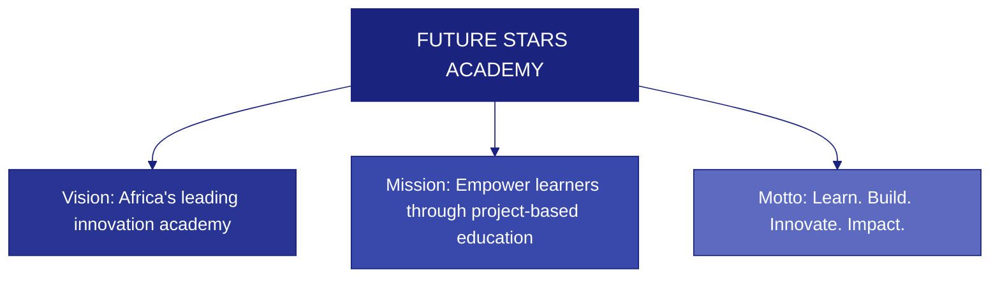

---

## TABLE OF CONTENTS

1. [Executive Summary](#1-executive-summary)
2. [Organization Profile](#2-organization-profile)
3. [Business Problem](#3-business-problem)
4. [The Solution](#4-the-solution)
5. [Target Market](#5-target-market)
6. [Flagship Projects](#6-flagship-projects)
7. [Existing Assets](#7-existing-assets)
8. [Funding Required & Use of Funds](#8-funding-required--use-of-funds)
9. [Business Model & Revenue Streams](#9-business-model--revenue-streams)
10. [Current Readiness](#10-current-readiness)
11. [Financial Summary & Projections](#11-financial-summary--projections)
12. [Social Impact & KPIs](#12-social-impact--kpis)
13. [Why Invest in Future Stars Academy?](#13-why-invest-in-future-stars-academy)
14. [Risk Management](#14-risk-management)
15. [Implementation Roadmap](#15-implementation-roadmap)
16. [Conclusion & Call to Action](#16-conclusion--call-to-action)

**Appendices**
- [Appendix A: Founder Profile](#appendix-a-founder-profile)
- [Appendix B: Business Model Canvas](#appendix-b-business-model-canvas)
- [Appendix C: SWOT Analysis](#appendix-c-swot-analysis)
- [Appendix D: Three-Year Financial Projections](#appendix-d-three-year-financial-projections)
- [Appendix E: Startup Budget Detail](#appendix-e-startup-budget-detail)
- [Appendix F: Asset Register](#appendix-f-asset-register)
- [Appendix G: Risk Management Plan](#appendix-g-risk-management-plan)
- [Appendix H: Marketing Strategy](#appendix-h-marketing-strategy)
- [Appendix I: Operational Plan](#appendix-i-operational-plan)
- [Appendix J: Monitoring & Evaluation Framework](#appendix-j-monitoring--evaluation-framework)
- [Appendix K: 24-Month Gantt Chart](#appendix-k-24-month-gantt-chart)
- [Appendix L: Organizational Structure](#appendix-l-organizational-structure)
- [Appendix M: Curriculum Framework](#appendix-m-curriculum-framework)
- [Appendix N: Innovation Passport Overview](#appendix-n-innovation-passport-overview)
- [Appendix O: Five-Year Strategic Roadmap](#appendix-o-five-year-strategic-roadmap)
- [Appendix P: Stakeholder Ecosystem Map](#appendix-p-stakeholder-ecosystem-map)

---

## 1. EXECUTIVE SUMMARY

Future Stars Academy is an innovation-driven educational institution established to prepare children and young people for the future through **project-based learning**, **Artificial Intelligence**, **software development**, **engineering**, **entrepreneurship**, **leadership**, and **technology-enabled vocational education**.

Unlike traditional educational institutions, the Academy begins with **real community problems** and guides learners through research, design, prototyping, implementation, and business creation.

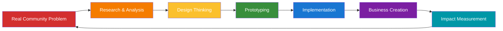

The Academy initially serves **learners aged 10–18 years** through after-school programmes, weekend innovation academies, holiday boot camps, and online learning while they continue attending their existing schools. Over time, Future Stars Academy will expand to serve learners of all ages.

| Metric | Value |
|--------|-------|
| **Funding Requested** | M300,000 |
| **Founder Contribution** | ~M230,500 (in-kind assets, IP, equipment) |
| **Total Project Value** | M530,500 |
| **Year 1 Target Learners** | 40 |
| **Year 1 Projected Revenue** | M691,000 |
| **Year 3 Projected Revenue** | M2M+ |
| **Breakeven Timeline** | Within Year 1 |

---

## 2. ORGANIZATION PROFILE

| Field | Detail |
|-------|--------|
| **Business Name** | Future Stars Academy |
| **Business Type** | Innovation and Technology Education Institution |
| **Legal Structure** | To be registered (recommended: Private Limited Company by Guarantee or Social Enterprise) |
| **Location** | Maseru, Lesotho |
| **Founder** | Moshoeshoe Koali |

### Vision

To become **Africa's leading innovation academy** that develops problem-solvers, entrepreneurs, engineers, and technology leaders capable of transforming communities through innovation.

### Mission

To empower learners through **project-based education**, **technology**, **entrepreneurship**, **leadership**, and **vocational innovation**, enabling them to identify community challenges and create sustainable solutions.

### Motto

**Learn. Build. Innovate. Impact.**

### Core Values

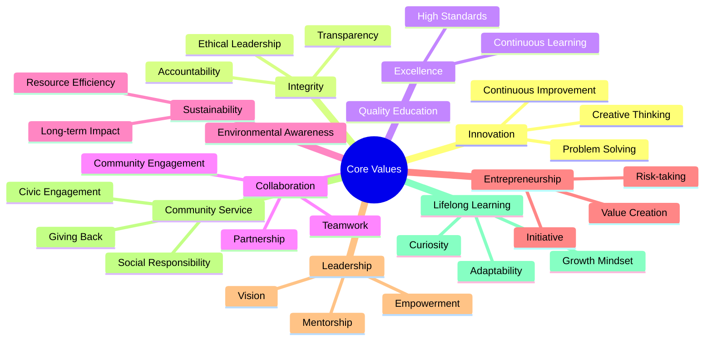

---

## 3. BUSINESS PROBLEM

### The Educational-Employment Gap in Lesotho

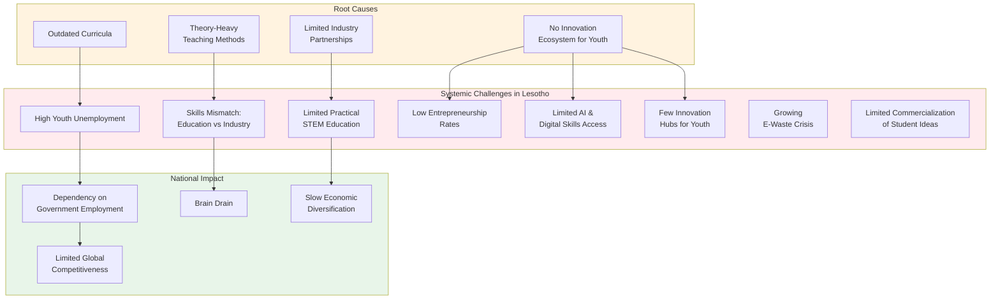

### Key Statistics & Context

| Challenge | Current State | Future Stars Solution |
|-----------|---------------|----------------------|
| **Youth Unemployment** | Lesotho's youth unemployment rate remains critically high, with limited formal sector absorption | Equip learners with entrepreneurial and technical skills to create their own opportunities |
| **Skills Mismatch** | Education system emphasizes theory over practical application | Project-based learning ensures hands-on experience with real deliverables |
| **STEM Access** | Limited laboratory infrastructure in schools | Dedicated innovation lab with robotics, AI, and engineering equipment |
| **AI Readiness** | Minimal AI education at secondary level | Structured AI curriculum from fundamentals to applied projects |
| **Innovation Hubs** | Few spaces dedicated to youth innovation | Dedicated innovation centre with mentorship and incubation support |
| **E-Waste** | Growing environmental challenge | Integrate e-waste recycling and upcycling into engineering programmes |

---

## 4. THE SOLUTION

### Future Stars Academy Programme Model

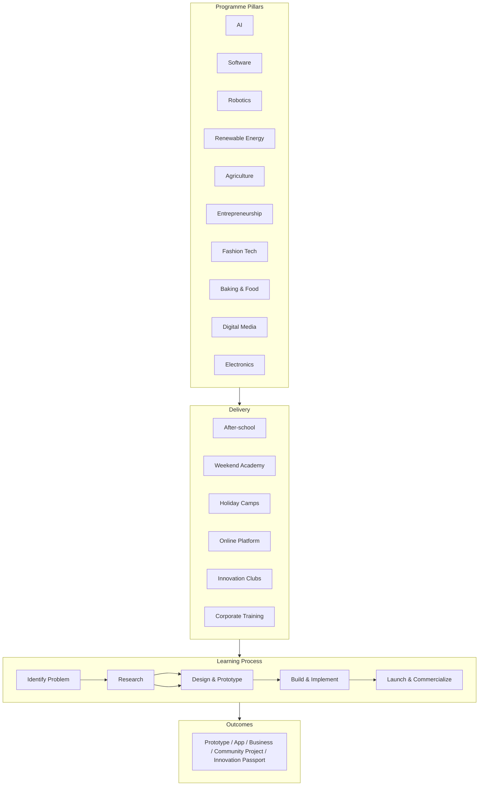

### Programme Offerings Matrix

| Programme | Format | Duration | Fee Structure | Class Size |
|-----------|--------|----------|---------------|------------|
| **After-School Innovation Club** | Weekly sessions | Per term (12 weeks) | M350/month | 15 max |
| **Saturday Innovation Academy** | Weekend intensive | 8 Saturdays | M500/month | 20 max |
| **Holiday Innovation Boot Camp** | Full-day immersion | 1-2 weeks | M1,500/camp | 25 max |
| **School Innovation Clubs** | In-school partnership | Per term | M200/learner | 30 max |
| **Online Learning** | Self-paced + live | Ongoing | M150/month | Unlimited |
| **Corporate Training** | Custom workshops | Per engagement | Negotiated | Variable |

---

## 5. TARGET MARKET

### Market Segmentation

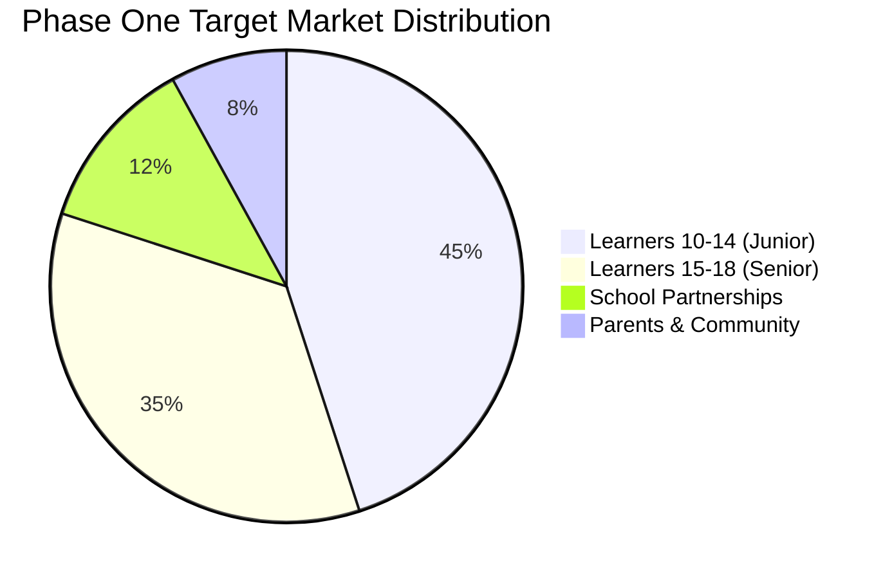

### Market Expansion Roadmap

| Phase | Timeline | Target Audience | Delivery Model | Est. Learners |
|-------|----------|-----------------|----------------|:------------:|
| **Phase 1** | Year 1 | Children 10-18 | After-school, Weekends, Holidays, Online | 40 |
| **Phase 2** | Year 2 | + Teachers, Schools | School clubs, Teacher training | 80+ |
| **Phase 3** | Year 3 | + Adults, Corporates | Corporate training, Evening classes | 150+ |
| **Phase 4** | Year 4-5 | + Government, NGOs | Contract programmes, Community centres | 300+ |
| **Phase 5** | Year 5+ | Regional (Southern Africa) | Licensing, Franchise, Online | 500+ |

### Target Customer Personas

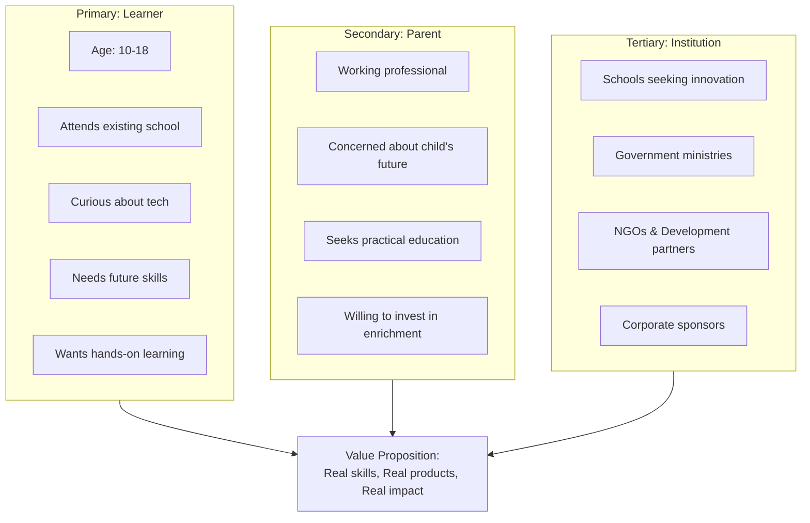

---

## 6. FLAGSHIP PROJECTS

### Innovation Project Portfolio

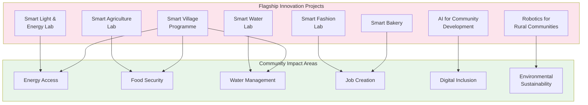

### Project Deep-Dive: Smart Village Programme

| Component | Description |
|-----------|-------------|
| **Problem** | Rural communities lack access to basic technology infrastructure |
| **Solution** | Learners design and deploy solar-powered community tech hubs |
| **Skills Applied** | Solar energy, networking, hardware assembly, software deployment |
| **Community Benefit** | Free Wi-Fi, digital literacy training, e-government access |
| **Commercial Potential** | Paid digital services, device charging stations, printing services |
| **SDG Alignment** | SDG 7 (Affordable & Clean Energy), SDG 9 (Industry, Innovation & Infrastructure) |

---

## 7. EXISTING ASSETS

### Current Asset Position

Future Stars Academy has already invested approximately **M230,500** in founder contributions:

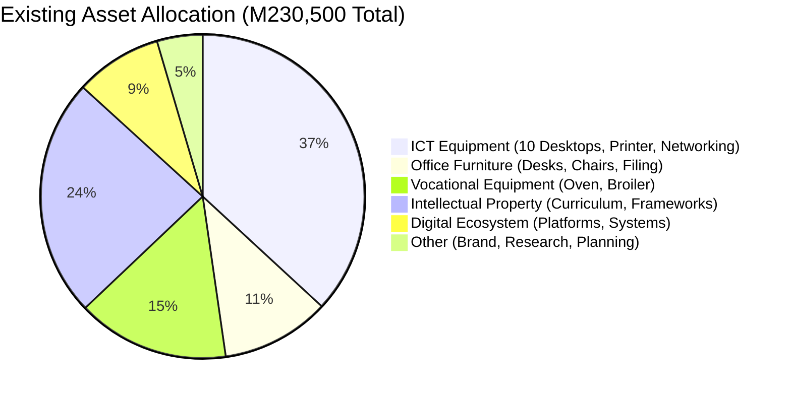

### Detailed Asset Register

| Asset Category | Items | Est. Value (M) | Condition |
|----------------|-------|:--------------:|:---------:|
| **Office Infrastructure** | 3 Desks, Chairs, Filing Systems | 25,000 | Good |
| **ICT Equipment** | 10 Desktop Computers, Printer, Networking | 85,000 | Functional |
| **Vocational Equipment** | Commercial Oven, Broiler | 35,000 | Good |
| **Intellectual Property** | Curriculum, Innovation Passport Framework | 55,000 | Developed |
| **Digital Ecosystem** | Project Frameworks, Digital Platforms | 20,000 | Operational |
| **Brand & Strategic Assets** | Business Strategy, Research, Brand | 10,500 | Established |
| **TOTAL** | | **230,500** | |

---

## 8. FUNDING REQUIRED & USE OF FUNDS

### Investment Request

**Total Funding Required: M300,000**

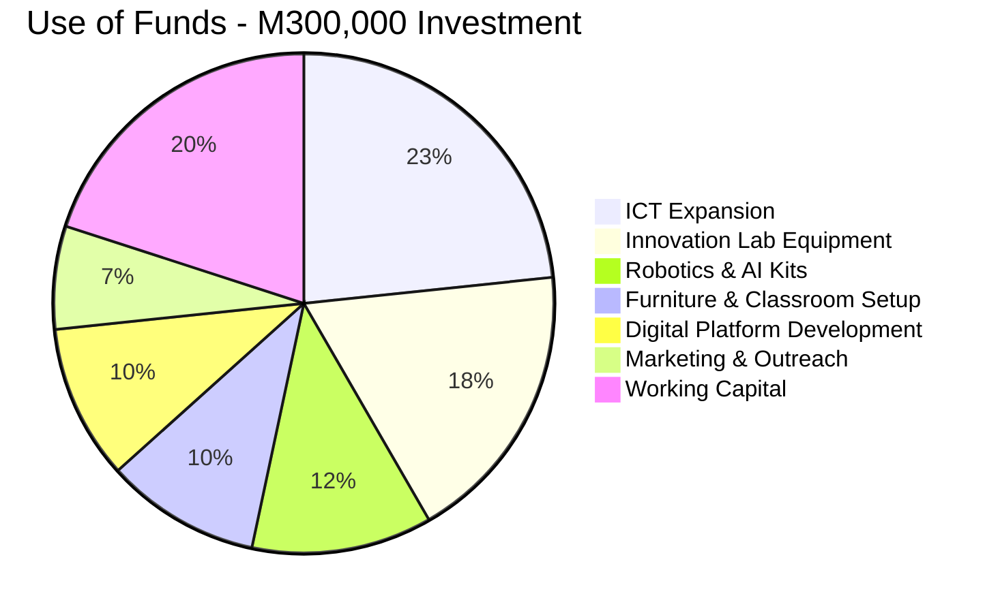

### Detailed Budget Allocation

| Item | Amount (M) | % of Total | Key Deliverables |
|------|:----------:|:----------:|------------------|
| **ICT Expansion** | 70,000 | 23.3% | 5 additional workstations, server, backup power, networking upgrade |
| **Innovation Lab Equipment** | 55,000 | 18.3% | Electronics workbench, 3D printer, soldering stations, test equipment |
| **Robotics & AI Kits** | 35,000 | 11.7% | Arduino kits, Raspberry Pi kits, sensors, motors, AI software licenses |
| **Furniture & Classroom** | 30,000 | 10.0% | Modular classroom furniture, whiteboards, project display boards |
| **Digital Platform Dev** | 30,000 | 10.0% | LMS enhancement, mobile app development, AI companion integration |
| **Marketing & Outreach** | 20,000 | 6.7% | Brand materials, social media campaigns, school visits, open days |
| **Working Capital** | 60,000 | 20.0% | 3-month operational buffer - rent, utilities, stipends, materials |
| **TOTAL** | **300,000** | **100%** | |

---

## 9. BUSINESS MODEL & REVENUE STREAMS

### Revenue Architecture

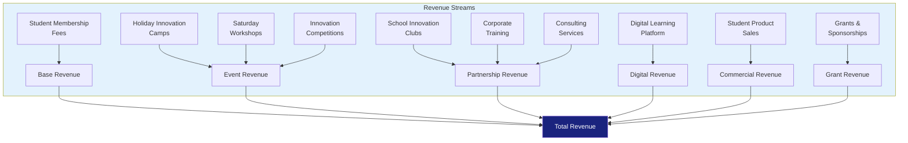

### Revenue Projection by Stream (Year 1-3)

| Revenue Stream | Year 1 (M) | Year 2 (M) | Year 3 (M) |
|----------------|:----------:|:----------:|:----------:|
| Student Membership Fees | 168,000 | 384,000 | 720,000 |
| Holiday Innovation Camps | 90,000 | 180,000 | 300,000 |
| Saturday Workshops | 120,000 | 240,000 | 360,000 |
| School Innovation Clubs | 48,000 | 120,000 | 240,000 |
| Corporate Training | 60,000 | 100,000 | 200,000 |
| Digital Learning Platform | 36,000 | 72,000 | 144,000 |
| Consulting Services | 40,000 | 80,000 | 120,000 |
| Student Product Sales | 24,000 | 48,000 | 96,000 |
| Grants & Sponsorships | 100,000 | 150,000 | 200,000 |
| Innovation Competitions | 5,000 | 10,000 | 20,000 |
| **TOTAL** | **691,000** | **1,384,000** | **2,400,000** |

### Year 1 Revenue Composition

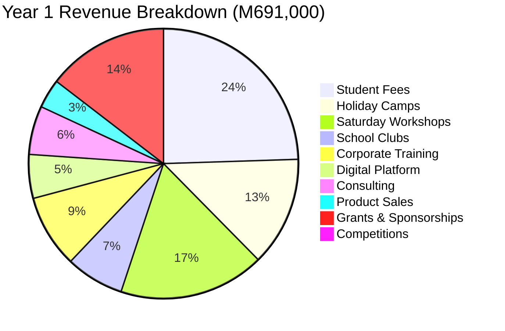

---

## 10. CURRENT READINESS

### Operational Readiness Assessment

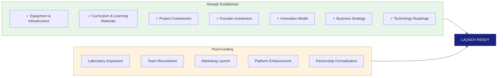

### Readiness Scorecard

| Area | Readiness Level | Current Status | Gap to Address |
|------|:--------------:|----------------|----------------|
| Curriculum | 90% | Fully developed with AI, coding, entrepreneurship | Industry validation, minor refinements |
| ICT Infrastructure | 75% | 10 workstations, printer, networking | Additional computers, server, backup power |
| Vocational Equipment | 80% | Oven, broiler, basic tools | Expanded kitchen/lab setup |
| Digital Platform | 65% | Framework established | Full LMS, mobile app, AI companion |
| Marketing | 40% | Brand identity, social media presence | Launch campaign, school outreach |
| Partnerships | 50% | Expressions of interest | Formal MOUs, agreements |
| Team | 30% | Founder + volunteers | Core staff recruitment |
| Facilities | 60% | Office space identified | Classroom/lab fit-out |

---

## 11. FINANCIAL SUMMARY & PROJECTIONS

### Three-Year Financial Trajectory

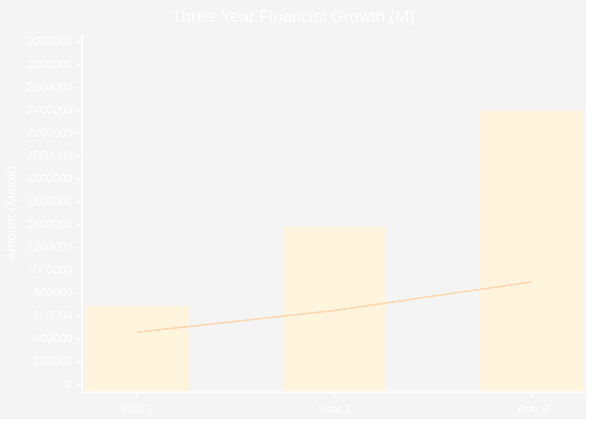

| Metric | Year 1 | Year 2 | Year 3 |
|--------|:------:|:------:|:------:|
| **Learners** | 40 | 80 | 150 |
| **Revenue (M)** | 691,000 | 1,384,000 | 2,400,000 |
| **Operating Expenses (M)** | 460,000 | 650,000 | 900,000 |
| **Projected Surplus (M)** | 231,000 | 734,000 | 1,500,000 |
| **Surplus Margin** | 33.4% | 53.0% | 62.5% |
| **Cumulative Surplus (M)** | 231,000 | 965,000 | 2,465,000 |

### Key Financial Assumptions

| Assumption | Basis |
|------------|-------|
| Average fee per learner/month | M350 (blended across programmes) |
| Learner growth rate | 100% YoY (Years 1-2), 87.5% (Years 2-3) |
| Operating expense growth | 41% YoY (Years 1-2), 38% (Years 2-3) |
| Grant income (Year 1) | M100,000 (conservative estimate) |
| Breakeven | Month 6-7 of Year 1 |
| Founder draw | Minimum in Year 1, reinvesting surplus |

### Cost Structure Breakdown

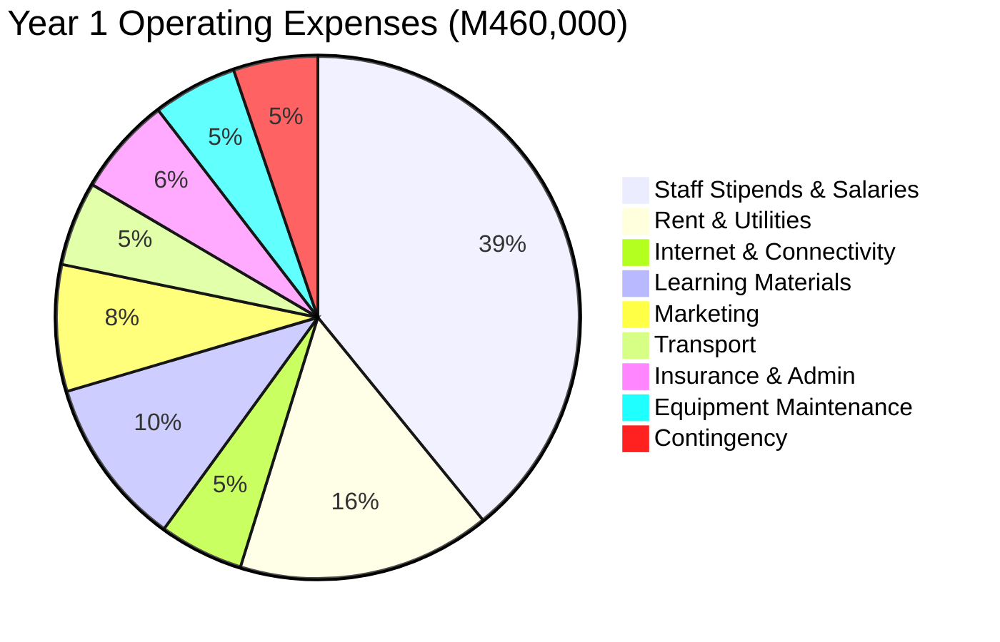

---

## 12. SOCIAL IMPACT & KPIs

### Impact Framework

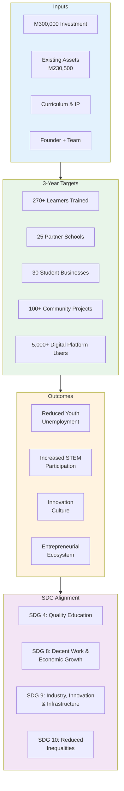

### Key Performance Indicators (KPIs)

| KPI | Year 1 | Year 2 | Year 3 | Measurement Method |
|-----|:------:|:------:|:------:|-------------------|
| **Active Learners** | 40 | 80 | 150 | Enrolment records |
| **Partner Schools** | 5 | 15 | 25 | Signed MOUs |
| **Student Businesses Launched** | 5 | 15 | 30 | Business registration |
| **Community Projects Completed** | 15 | 45 | 100 | Project reports |
| **Innovation Passports Issued** | 40 | 80 | 150 | Digital credentials |
| **Digital Platform Users** | 500 | 2,000 | 5,000 | Analytics |
| **Retention Rate** | 80% | 85% | 90% | Termly reports |
| **Jobs Created (Student ventures)** | 5 | 20 | 50 | Business surveys |
| **Female Participation** | 50% | 50% | 50% | Enrolment data |
| **Rural Reach** | 20% | 30% | 40% | Geolocation data |

---

## 13. WHY INVEST IN FUTURE STARS ACADEMY?

### Investment Value Proposition

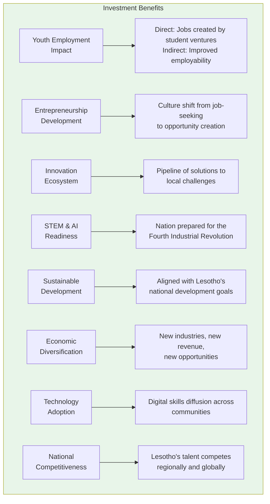

### Return on Investment (ROI) Analysis

| Investor Type | Tangible ROI | Intangible ROI |
|---------------|--------------|----------------|
| **Government** | Reduced unemployment spend, increased tax base | National competitiveness, innovation culture |
| **Development Partner** | Measurable SDG impact at low cost per beneficiary | Sustainable model, community ownership |
| **Corporate Sponsor** | Pipeline of skilled talent, CSR impact | Brand association with innovation |
| **Angel Investor** | Potential equity in student startups | First-mover access to innovation ecosystem |
| **Bank/Financial Institution** | Interest income, client acquisition | Community development mandate fulfillment |

### Multiplier Effect

For every **M1** invested in Future Stars Academy:

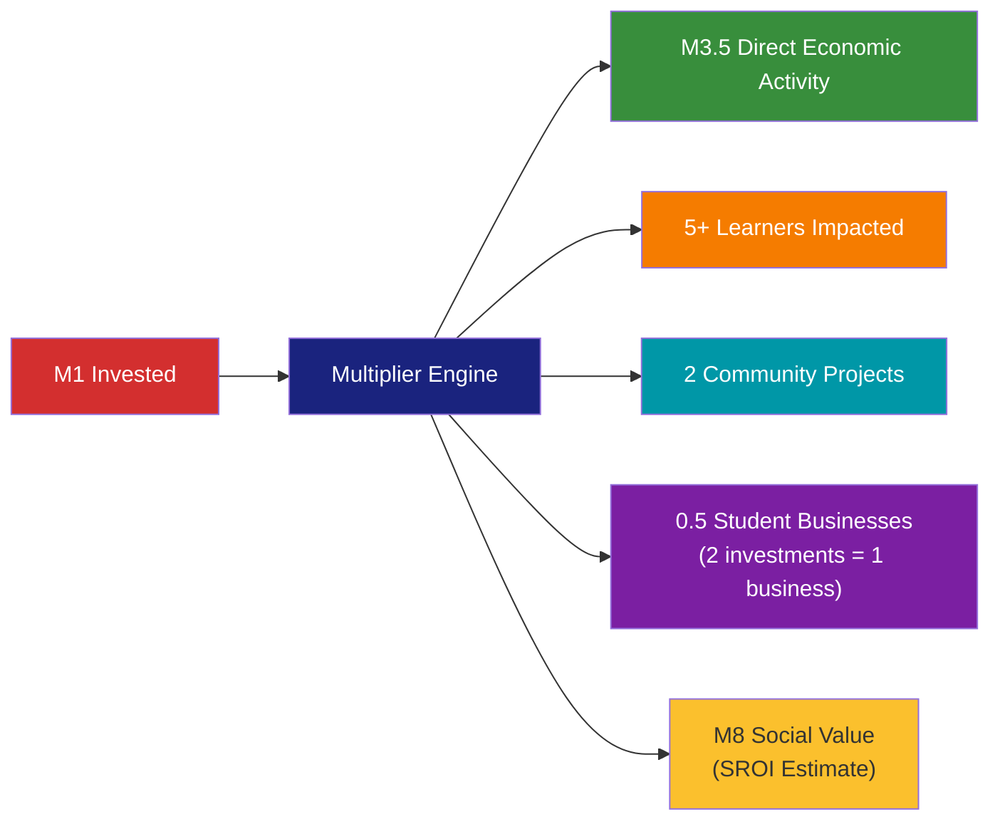

---

## 14. RISK MANAGEMENT

### Risk Matrix

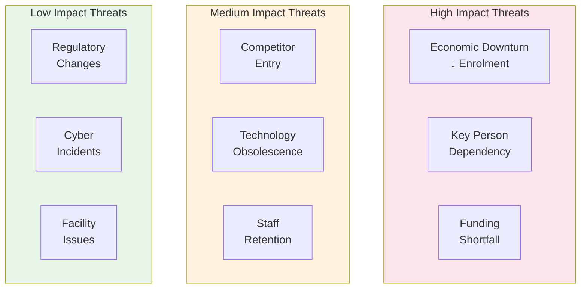

### Mitigation Strategies

| Risk | Probability | Impact | Mitigation |
|------|:----------:|:------:|------------|
| Economic downturn affecting fees | Medium | High | Flexible payment plans, scholarship fund, corporate sponsorships |
| Key person dependency (founder) | Medium | High | Document all processes, recruit deputy, build management team |
| Funding shortfall | Medium | High | Diversified revenue (10 streams), lean operations, phased growth |
| Competitor entry | Medium | Medium | Continuous innovation, strong brand, community lock-in |
| Technology obsolescence | Medium | Medium | Annual curriculum review, industry partnerships, modular equipment |
| Staff retention | Low | Medium | Professional development, performance incentives, positive culture |
| Regulatory changes | Low | Low | Legal compliance monitoring, government partnerships |
| Cyber incidents | Low | Low | Cloud security, backups, MFA, staff training |
| Facility issues | Low | Low | Insurance, maintenance fund, flexible space agreements |

---

## 15. IMPLEMENTATION ROADMAP

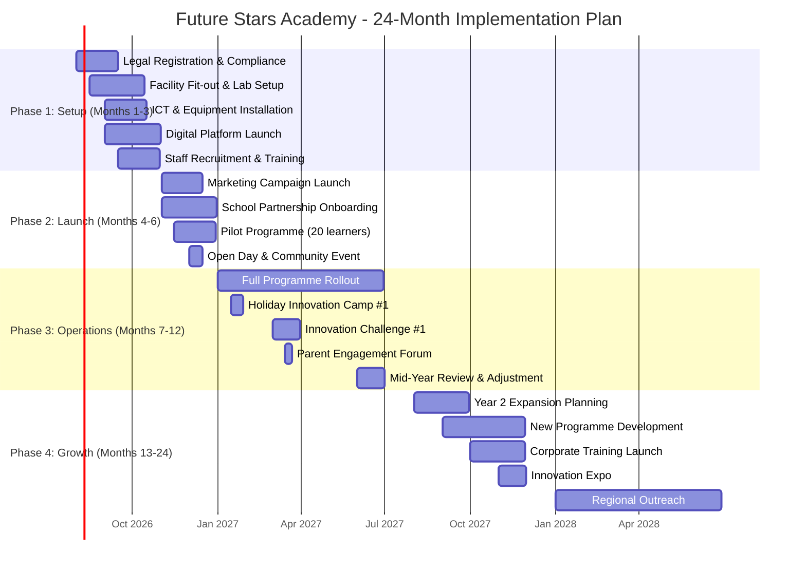

### Critical Milestones

| Milestone | Target Date | Key Deliverable | Success Criteria |
|-----------|-------------|-----------------|------------------|
| **Legal Registration** | Aug 2026 | Business registration, tax clearance | Registered entity |
| **Facility Ready** | Oct 2026 | Functional innovation lab | Pass safety & readiness inspection |
| **Pilot Launch** | Nov 2026 | First 20 learners enrolled | Full capacity utilization |
| **Full Operations** | Jan 2027 | All programmes operational | 40 active learners |
| **Breakeven** | Feb 2027 | Revenue ≥ Expenses | Positive cash flow from operations |
| **Year 1 Review** | Jul 2027 | Impact report, financial audit | 80%+ KPI achievement |
| **Year 2 Launch** | Aug 2027 | 80 learners, 15 school partners | Expansion targets met |

---

## 16. CONCLUSION & CALL TO ACTION

### Summary of Opportunity

Future Stars Academy represents a **new model of education** for Lesotho — one that equips learners not only with knowledge but with the skills, confidence, and entrepreneurial mindset needed to solve real-world problems.

By integrating technology, vocational training, innovation, and community engagement, the Academy prepares young people to become **creators of opportunities** rather than seekers of employment.

### The Ask

| Item | Detail |
|------|--------|
| **Investment Required** | M300,000 |
| **Phase** | Phase One Operations |
| **Existing Investment** | M230,500 (Founder) |
| **Total Project Value** | M530,500 |
| **Expected Return** | Financial sustainability within 6 months, 33%+ surplus margin Year 1 |
| **Social Return** | 40+ learners impacted Year 1, 270+ by Year 3 |

### Invitation

We invite partners — government agencies, development organizations, corporate sponsors, financial institutions, and impact investors — to join us in shaping the **next generation of innovators and leaders** who will drive sustainable development in Lesotho and beyond.

---

```mermaid
flowchart TB
    subgraph CLOSE[Together We Can Build]
        C1[Future-ready youth]
        C2[Thriving innovation ecosystem]
        C3[Sustainable enterprises]
        C4[Transformed communities]
    end
    
    PARTNER[Strategic Partners & Investors] --> CLOSE
    FOUNDER[Founder & Team] --> CLOSE
    COMMUNITY[Community & Schools] --> CLOSE
    
    C1 --> IMPACT[Shared Impact:<br/>A Prosperous, Innovative Lesotho]
    C2 --> IMPACT
    C3 --> IMPACT
    C4 --> IMPACT
    
    style CLOSE fill:#e3f2fd,color:#333
    style IMPACT fill:#1a237e,color:#fff
    style PARTNER fill:#388e3c,color:#fff
    style FOUNDER fill:#f57c00,color:#fff
    style COMMUNITY fill:#7b1fa2,color:#fff
```

---

**Contact:** Moshoeshoe Koali
**Email:** [To be inserted]
**Phone:** [To be inserted]
**Location:** Maseru, Lesotho

---

*"Learn. Build. Innovate. Impact."*

---
