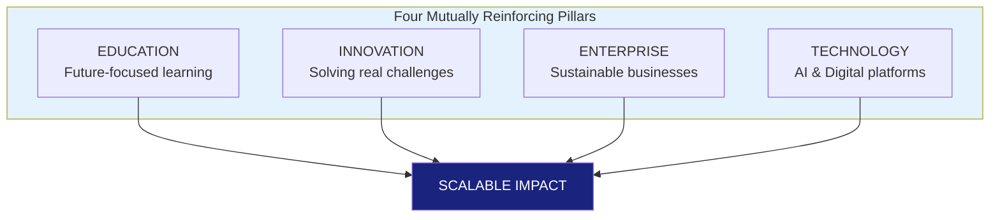

# APPENDIX B: BUSINESS MODEL CANVAS

## Future Stars Academy

---

**Business Concept:** A technology-driven innovation academy that empowers learners to solve real community challenges through project-based education, Artificial Intelligence, engineering, software development, entrepreneurship, and technology-enabled vocational training.

---

## Business Model Canvas

| Key Partners | Key Activities | Value Propositions | Customer Relationships | Customer Segments |
|:------------:|:--------------:|:------------------:|:----------------------:|:-----------------:|
| Ministry of Education & Training | Project-based education | Learn by solving real community problems | Personalized mentoring | Learners (10-18 years) |
| BEDCO | AI & Coding Training | Students graduate with real products and businesses | AI Learning Companion | Parents |
| Universities & TVET Institutions | Software Development | Innovation Passport (skills-based credentials) | Parent Engagement Portal | Schools |
| Local Schools | Robotics & Engineering | Industry-relevant skills for the future workforce | Innovation Passport | Government |
| ICT Companies | Renewable Energy Projects | Technology-integrated vocational education | Alumni Network | NGOs |
| Banks & Financial Institutions | Entrepreneurship Training | Students create jobs rather than seek jobs | Innovation Clubs | Development Partners |
| NGOs & Development Partners | Business Incubation | Community-driven innovation | Community Projects | Corporate Sponsors |
| Technology Companies (Microsoft, Google, OpenAI, Huawei, Cisco, etc.) | Research & Development | Flexible after-school, weekend, holiday, and online learning | Industry Mentorship | Businesses |
| Renewable Energy Companies | Innovation Challenges | Personalized AI-supported learning | Startup Incubation | Universities |
| Local Businesses | Community Projects | Real-world project portfolio before graduation | Lifelong Learning | Adult Learners (Phase 2) |
| Farmers & Community Leaders | Student Mentorship | Strong focus on sustainability and entrepreneurship | | |

| Key Resources | Channels |
|:-------------:|:--------:|
| Innovation Curriculum | After-school programmes |
| Qualified Facilitators | Weekend Innovation Academy |
| AI Learning Platform | Holiday Innovation Camps |
| Desktop Computer Laboratory | Online Learning Platform |
| Innovation Laboratory | School Innovation Clubs |
| Robotics Kits | Community Innovation Centres |
| Engineering Tools | Corporate Training |
| Renewable Energy Laboratory | Social Media |
| Baking & Food Innovation Lab | Website |
| Fashion & Design Studio | Community Demonstration Projects |
| Learning Management System | Innovation Expos |
| Innovation Passport Platform | Radio & Television |
| Founder Expertise | Referrals |
| Existing Equipment | Partnerships with Schools |

| Cost Structure | Revenue Streams |
|:--------------:|:---------------:|
| Staff Salaries | Student Membership Fees |
| Rent | Holiday Innovation Camps |
| Utilities | Weekend Workshops |
| Internet | School Innovation Clubs |
| Laboratory Equipment | Corporate Training |
| Learning Materials | Consulting Services |
| Robotics Kits | Digital Learning Platform |
| AI Software | Innovation Competitions |
| Marketing | Student Product Sales |
| Insurance | Business Incubation Services |
| Equipment Maintenance | Grants & Sponsorships |
| Transport | Technology Licensing (Future) |
| Platform Development | Innovation Passport Certification (Future) |

---

## Detailed Explanation

### 1. Value Proposition

Future Stars Academy provides a unique educational experience that combines traditional learning with innovation, technology, entrepreneurship, and vocational education.

Unlike conventional institutions, every programme begins with a **real-world problem** and concludes with a **practical solution** — a prototype, software application, engineered product, business venture, or community intervention.

**Learners benefit from:**
- Project-based education
- Artificial Intelligence integration
- Software development
- Robotics and engineering
- Renewable energy technologies
- Smart agriculture
- Technology-enabled vocational skills
- Entrepreneurship and startup creation
- Leadership development
- Community engagement
- Digital Innovation Passport recording practical achievements

### 2. Customer Segments

**Primary:**
- Learners aged 10-18 enrolled in existing schools
- Parents seeking future-focused education

**Secondary:**
- Schools requiring innovation programmes
- Government ministries
- NGOs
- Development partners
- Corporate organizations investing in STEM education

**Future:**
- University students
- Teachers
- Entrepreneurs
- Working professionals
- Community groups
- Adult learners

### 3. Channels

**Physical:**
- Innovation Centre
- Partner Schools
- Community Workshops
- Holiday Camps
- Innovation Exhibitions

**Digital:**
- Learning Management System
- Mobile Application
- AI Learning Companion
- Website
- Virtual Classrooms
- YouTube tutorials
- Social media

### 4. Customer Relationships

- Individual mentoring
- Continuous portfolio development
- Innovation Passport tracking
- Parent engagement
- Alumni programmes
- Startup incubation
- Career guidance
- Lifelong access to learning resources

### 5. Key Activities

- Teaching AI, coding, and software development
- Delivering engineering and robotics programmes
- Facilitating technology-enabled vocational training
- Running innovation projects
- Organizing hackathons and competitions
- Supporting startup incubation
- Conducting community research
- Developing digital learning resources
- Measuring project impact
- Building strategic partnerships

### 6. Key Resources

- Innovation Curriculum
- Qualified Facilitators
- AI Learning Platform
- Desktop Computer Laboratory
- Innovation Laboratory
- Robotics Kits
- Engineering Tools
- Renewable Energy Laboratory
- Baking & Food Innovation Lab
- Fashion & Design Studio
- Learning Management System
- Innovation Passport Platform
- Founder Expertise
- Existing Equipment

### 7. Key Partners

- Ministry of Education and Training
- BEDCO
- Universities & TVET institutions
- Technology companies
- Financial institutions
- Renewable energy companies
- NGOs
- Schools
- Local communities
- Corporate sponsors

### 8. Cost Structure

- Personnel
- Facility rental
- Utilities
- Internet connectivity
- Laboratory equipment
- Software licenses
- Marketing
- Transport
- Insurance
- Programme materials
- Digital platform maintenance

### 9. Revenue Streams

- Monthly student fees
- Holiday innovation camps
- Weekend workshops
- School-based innovation clubs
- Corporate training
- Consultancy in AI and digital transformation
- Digital learning subscriptions
- Innovation competitions and events
- Commercialization of student-developed products
- Business incubation services
- Grants and sponsorships
- Future licensing of the Future Stars Digital Ecosystem

---

## Strategic Pillars

This integrated approach differentiates Future Stars Academy from traditional tuition centres, coding schools, vocational colleges, and innovation hubs by combining all four pillars into one coherent, scalable model.

---

*Business Model Canvas adapted from Osterwalder & Pigneur (2010)*
