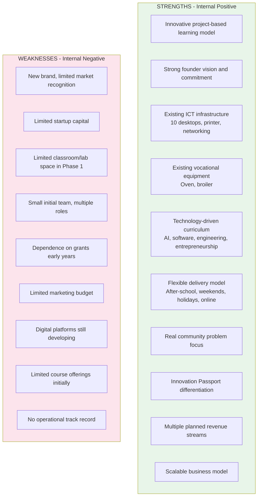
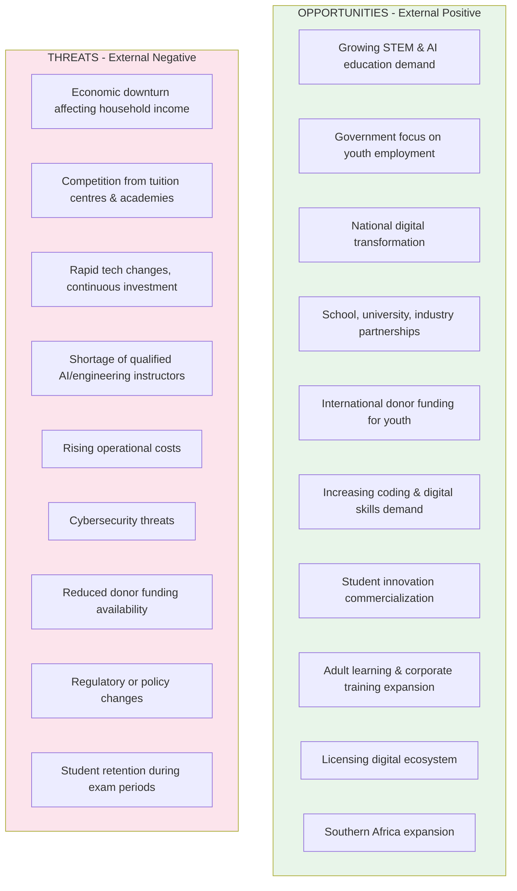

# APPENDIX C: SWOT ANALYSIS

## Future Stars Academy

---

**Purpose:** This SWOT analysis evaluates internal and external factors influencing the successful establishment and growth of Future Stars Academy, outlining strategic responses to maximize strengths and opportunities while addressing weaknesses and mitigating risks.

---

## 1. SWOT Matrix

---

## 2. Strengths (Internal Positive Factors)

### 2.1 Innovative Educational Model

Project-based learning integrating technology, entrepreneurship, engineering, and vocational education. Students solve real community challenges and develop practical solutions.

**Strategic Advantage:**
- Differentiates from traditional tutoring centres
- Produces graduates with practical portfolios and real-world experience

### 2.2 Strong Founder Commitment

Founder has already invested in equipment, curriculum development, strategic planning, and educational resources before seeking external funding.

**Current Founder Investment:**
- 10 desktop computers
- 3 office desks
- Printer
- Commercial oven
- Broiler
- Curriculum development
- Innovation framework
- Business planning

### 2.3 Existing Infrastructure

Unlike many startups, the Academy already possesses essential operational resources, reducing startup costs and enabling quicker implementation.

**Existing assets provide immediate capacity for:**
- Coding classes
- AI training
- Research
- Digital literacy
- Entrepreneurship
- Baking and food innovation

### 2.4 Flexible Learning Model

Students remain enrolled in their existing schools while participating through after-school, weekend, holiday, and online programmes.

### 2.5 Strong Community Impact

Every learning project addresses a genuine community challenge — renewable energy, smart agriculture, water management, digital inclusion, food security, youth entrepreneurship.

---

## 3. Weaknesses (Internal Negative Factors)

| Weakness | Mitigation |
|----------|------------|
| Limited startup capital | Phased funding, grants, multiple revenue streams, surplus reinvestment |
| New brand | High-quality programmes, student showcases, strategic partnerships, social media |
| Small initial team | Volunteer mentors, university interns, AI tools for productivity |
| Limited physical space | Staggered schedules, partner school facilities, phased expansion |
| Grant dependence | Sustainable revenue through fees, corporate training, consulting, digital subscriptions |

---

## 4. Opportunities (External Positive Factors)

| Opportunity | Strategic Response |
|------------|-------------------|
| Growing demand for future skills | Position as premier innovation education provider |
| Government priorities alignment | Engage MOET, BEDCO, LNDC for partnerships and funding |
| Strategic partnerships | Actively build partner pipeline with clear value propositions |
| Expansion potential | Design scalable model from day one for replication |
| Commercialization | Build incubation pathway for student innovations |

---

## 5. Threats (External Negative Factors)

| Threat | Mitigation |
|--------|------------|
| Economic conditions | Flexible payment, scholarships, corporate sponsorship |
| Competition | Integrated model (not just coding), community focus, Innovation Passport |
| Technology changes | Annual curriculum review, industry partnerships, continuous investment |
| Funding fluctuation | Diversified revenue, sustainable business model |
| Cybersecurity | Secure cloud, backups, MFA, audits, training |

---

## 6. TOWS Strategic Analysis

### SO Strategies (Strengths + Opportunities)

| # | Strategy |
|:-:|----------|
| SO1 | Leverage innovative curriculum and existing assets to secure partnerships with schools, government, and technology companies |
| SO2 | Expand programmes in AI, engineering, and entrepreneurship to meet growing demand |
| SO3 | Use flexible delivery model to reach learners across multiple schools and communities |
| SO4 | Capitalize on Innovation Passport to differentiate from emerging competitors |

### ST Strategies (Strengths + Threats)

| # | Strategy |
|:-:|----------|
| ST1 | Differentiate through Innovation Passport and real-world projects to remain competitive |
| ST2 | Use existing infrastructure to keep costs low and weather economic fluctuations |
| ST3 | Build multiple revenue streams to reduce dependency on any single source |
| ST4 | Develop digital platform capability to enable remote learning during disruptions |

### WO Strategies (Weaknesses + Opportunities)

| # | Strategy |
|:-:|----------|
| WO1 | Address funding gaps by securing grants aligned with government and donor priorities |
| WO2 | Build brand through strategic partnerships with established institutions |
| WO3 | Leverage corporate training revenue to supplement limited initial fee income |
| WO4 | Use digital platform to scale reach beyond physical space limitations |

### WT Strategies (Weaknesses + Threats)

| # | Strategy |
|:-:|----------|
| WT1 | Implement phased growth aligned with enrolment and revenue |
| WT2 | Maintain lean operating model with variable rather than fixed costs |
| WT3 | Diversify income streams across fees, grants, corporate, and commercial |
| WT4 | Continuously strengthen governance, quality, and operational capacity |

---

## 7. Strategic Conclusion

Future Stars Academy possesses **strong internal capabilities** — innovative educational model, committed leadership, existing infrastructure, and clear strategic vision. While facing startup challenges (limited capital, brand recognition, operational capacity), these can be addressed through **phased growth, strategic partnerships, and diversified revenue**.

External opportunities are **substantial**, driven by increasing demand for STEM education, digital skills, entrepreneurship, and innovation across Lesotho and the region.

With appropriate investment and effective execution, Future Stars Academy is positioned to evolve from a **local after-school innovation programme** into a **nationally recognized innovation ecosystem** — combining technology, project-based education, entrepreneurship, and community engagement to create measurable social and economic impact.

---

*SWOT Analysis completed July 2026. Recommended review: Annually or when significant market changes occur.*
