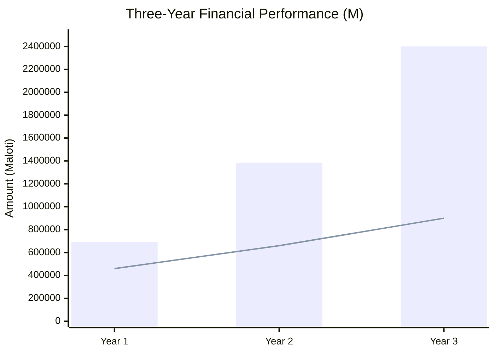

# APPENDIX D: THREE-YEAR FINANCIAL PROJECTIONS

## Future Stars Academy

---

## Assumptions

| Assumption | Value | Basis |
|------------|:-----:|-------|
| Average monthly fee per learner | M350 | Blended across programmes |
| Capacity utilization Year 1 | 40% | Conservative startup estimate |
| Fee increase Year 2 | 10% | Market adjustment |
| Operating expense inflation | 8% annually | Lesotho CPI + margin |
| Grant income (Year 1) | M100,000 | Conservative |
| Corporate training revenue growth | 67% YoY | New channel development |
| Digital platform monetization | Month 6 | Ramp-up period |

---

## Year 1: Monthly Revenue Projection (M)

| Revenue Stream | M1 | M2 | M3 | M4 | M5 | M6 | M7 | M8 | M9 | M10 | M11 | M12 | **Total** |
|----------------|---|---|---|---|---|---|---|---|---|----|----|----|:--------:|
| Student Fees | 0 | 0 | 0 | 14,000 | 14,000 | 14,000 | 14,000 | 14,000 | 14,000 | 14,000 | 14,000 | 14,000 | **126,000** |
| Holiday Camps | 0 | 0 | 0 | 0 | 45,000 | 0 | 0 | 0 | 45,000 | 0 | 0 | 0 | **90,000** |
| Saturday Workshops | 0 | 0 | 0 | 10,000 | 10,000 | 10,000 | 10,000 | 10,000 | 10,000 | 10,000 | 10,000 | 10,000 | **90,000** |
| School Clubs | 0 | 0 | 0 | 0 | 12,000 | 12,000 | 12,000 | 0 | 12,000 | 12,000 | 0 | 0 | **60,000** |
| Corporate Training | 0 | 0 | 0 | 0 | 0 | 0 | 20,000 | 0 | 0 | 20,000 | 0 | 20,000 | **60,000** |
| Digital Platform | 0 | 0 | 0 | 0 | 0 | 6,000 | 6,000 | 6,000 | 6,000 | 6,000 | 6,000 | 0 | **36,000** |
| Consulting | 0 | 0 | 0 | 0 | 0 | 0 | 0 | 20,000 | 0 | 0 | 20,000 | 0 | **40,000** |
| Student Product Sales | 0 | 0 | 0 | 0 | 0 | 0 | 6,000 | 6,000 | 6,000 | 6,000 | 0 | 0 | **24,000** |
| Grants & Sponsorships | 0 | 0 | 0 | 0 | 0 | 50,000 | 0 | 0 | 50,000 | 0 | 0 | 0 | **100,000** |
| Competitions | 0 | 0 | 0 | 0 | 0 | 0 | 5,000 | 0 | 0 | 0 | 0 | 0 | **5,000** |
| **TOTAL** | **0** | **0** | **0** | **24,000** | **81,000** | **92,000** | **73,000** | **56,000** | **133,000** | **68,000** | **50,000** | **44,000** | **691,000** |

## Year 1: Monthly Expense Projection (M)

| Expense Category | M1 | M2 | M3 | M4 | M5 | M6 | M7 | M8 | M9 | M10 | M11 | M12 | **Total** |
|-----------------|---|---|---|---|---|---|---|---|---|----|----|----|:--------:|
| Staff Stipends | 15,000 | 15,000 | 15,000 | 15,000 | 15,000 | 15,000 | 15,000 | 15,000 | 15,000 | 15,000 | 15,000 | 15,000 | **180,000** |
| Rent & Utilities | 6,000 | 6,000 | 6,000 | 6,000 | 6,000 | 6,000 | 6,000 | 6,000 | 6,000 | 6,000 | 6,000 | 6,000 | **72,000** |
| Internet & Connectivity | 2,000 | 2,000 | 2,000 | 2,000 | 2,000 | 2,000 | 2,000 | 2,000 | 2,000 | 2,000 | 2,000 | 2,000 | **24,000** |
| Learning Materials | 8,000 | 8,000 | 4,000 | 4,000 | 4,000 | 4,000 | 4,000 | 4,000 | 4,000 | 4,000 | 4,000 | 4,000 | **48,000** |
| Marketing | 10,000 | 10,000 | 5,000 | 0 | 3,000 | 3,000 | 3,000 | 0 | 3,000 | 0 | 0 | 0 | **37,000** |
| Transport | 2,000 | 2,000 | 2,000 | 2,000 | 2,000 | 2,000 | 2,000 | 2,000 | 2,000 | 2,000 | 2,000 | 2,000 | **24,000** |
| Insurance & Admin | 3,000 | 3,000 | 3,000 | 2,000 | 2,000 | 2,000 | 2,000 | 2,000 | 2,000 | 2,000 | 2,000 | 2,000 | **27,000** |
| Equipment Maintenance | 2,000 | 2,000 | 2,000 | 2,000 | 2,000 | 2,000 | 2,000 | 2,000 | 2,000 | 2,000 | 2,000 | 2,000 | **24,000** |
| Contingency | 2,000 | 2,000 | 2,000 | 2,000 | 2,000 | 2,000 | 2,000 | 2,000 | 2,000 | 2,000 | 2,000 | 2,000 | **24,000** |
| **TOTAL** | **50,000** | **50,000** | **41,000** | **35,000** | **38,000** | **38,000** | **38,000** | **35,000** | **38,000** | **35,000** | **35,000** | **35,000** | **460,000** |

## Year 1: Cash Flow (M)

| Month | Revenue | Expenses | Net Cashflow | Cumulative |
|:----:|:------:|:--------:|:-----------:|:----------:|
| M1 | 0 | 50,000 | (50,000) | (50,000) |
| M2 | 0 | 50,000 | (50,000) | (100,000) |
| M3 | 0 | 41,000 | (41,000) | (141,000) |
| M4 | 24,000 | 35,000 | (11,000) | (152,000) |
| M5 | 81,000 | 38,000 | 43,000 | (109,000) |
| M6 | 92,000 | 38,000 | 54,000 | (55,000) |
| M7 | 73,000 | 38,000 | 35,000 | (20,000) |
| M8 | 56,000 | 35,000 | 21,000 | **1,000** |
| M9 | 133,000 | 38,000 | 95,000 | 96,000 |
| M10 | 68,000 | 35,000 | 33,000 | 129,000 |
| M11 | 50,000 | 35,000 | 15,000 | 144,000 |
| M12 | 44,000 | 35,000 | 9,000 | 153,000 |

> **Breakeven achieved: Month 8**

---

## Year 2: Projected Revenue (M)

| Revenue Stream | Q1 | Q2 | Q3 | Q4 | **Total** |
|----------------|:--:|:--:|:--:|:--:|:--------:|
| Student Fees | 96,000 | 96,000 | 96,000 | 96,000 | 384,000 |
| Holiday Camps | 45,000 | 45,000 | 45,000 | 45,000 | 180,000 |
| Saturday Workshops | 60,000 | 60,000 | 60,000 | 60,000 | 240,000 |
| School Clubs | 30,000 | 30,000 | 30,000 | 30,000 | 120,000 |
| Corporate Training | 25,000 | 25,000 | 25,000 | 25,000 | 100,000 |
| Digital Platform | 18,000 | 18,000 | 18,000 | 18,000 | 72,000 |
| Consulting | 20,000 | 20,000 | 20,000 | 20,000 | 80,000 |
| Student Product Sales | 12,000 | 12,000 | 12,000 | 12,000 | 48,000 |
| Grants & Sponsorships | 37,500 | 37,500 | 37,500 | 37,500 | 150,000 |
| Competitions | 2,500 | 2,500 | 2,500 | 2,500 | 10,000 |
| **TOTAL** | **346,000** | **346,000** | **346,000** | **346,000** | **1,384,000** |

## Year 2: Expenses (M)

| Category | Amount (M) |
|----------|:----------:|
| Staff Salaries | 280,000 |
| Rent & Utilities | 100,000 |
| Internet & Connectivity | 35,000 |
| Learning Materials | 70,000 |
| Marketing | 50,000 |
| Transport | 35,000 |
| Insurance & Admin | 35,000 |
| Equipment Maintenance | 30,000 |
| Contingency | 25,000 |
| **TOTAL** | **660,000** |

---

## Year 3: Projected Revenue (M)

| Revenue Stream | Q1 | Q2 | Q3 | Q4 | **Total** |
|----------------|:--:|:--:|:--:|:--:|:--------:|
| Student Fees | 180,000 | 180,000 | 180,000 | 180,000 | 720,000 |
| Holiday Camps | 75,000 | 75,000 | 75,000 | 75,000 | 300,000 |
| Saturday Workshops | 90,000 | 90,000 | 90,000 | 90,000 | 360,000 |
| School Clubs | 60,000 | 60,000 | 60,000 | 60,000 | 240,000 |
| Corporate Training | 50,000 | 50,000 | 50,000 | 50,000 | 200,000 |
| Digital Platform | 36,000 | 36,000 | 36,000 | 36,000 | 144,000 |
| Consulting | 30,000 | 30,000 | 30,000 | 30,000 | 120,000 |
| Student Product Sales | 24,000 | 24,000 | 24,000 | 24,000 | 96,000 |
| Grants & Sponsorships | 50,000 | 50,000 | 50,000 | 50,000 | 200,000 |
| Competitions | 5,000 | 5,000 | 5,000 | 5,000 | 20,000 |
| **TOTAL** | **600,000** | **600,000** | **600,000** | **600,000** | **2,400,000** |

## Year 3: Expenses (M)

| Category | Amount (M) |
|----------|:----------:|
| Staff Salaries | 400,000 |
| Rent & Utilities | 130,000 |
| Internet & Connectivity | 45,000 |
| Learning Materials | 90,000 |
| Marketing | 70,000 |
| Transport | 45,000 |
| Insurance & Admin | 45,000 |
| Equipment Maintenance | 40,000 |
| Contingency | 35,000 |
| **TOTAL** | **900,000** |

---

## Three-Year Summary

| Metric | Year 1 | Year 2 | Year 3 |
|--------|:------:|:------:|:------:|
| Revenue | M691,000 | M1,384,000 | M2,400,000 |
| Expenses | M460,000 | M660,000 | M900,000 |
| **Net Surplus** | **M231,000** | **M724,000** | **M1,500,000** |
| Surplus Margin | 33.4% | 52.3% | 62.5% |
| Cumulative Surplus | M231,000 | M955,000 | M2,455,000 |
| Learners | 40 | 80 | 150 |
| Revenue per Learner | M17,275 | M17,300 | M16,000 |

---

## Breakeven Analysis

| Metric | Value |
|--------|:-----:|
| Fixed Monthly Costs (Year 1) | M35,000 |
| Average Revenue per Learner/Month | M350 |
| Breakeven Learners/Month | 22 learners |
| Breakeven Month | Month 8 |
| Months to Positive Cash Flow | 8 months |

---

## Sensitivity Analysis

| Scenario | Revenue Change | Year 1 Surplus | Impact |
|----------|:-------------:|:--------------:|--------|
| **Base Case** | — | M231,000 | As projected |
| **Optimistic** | +20% | M369,200 | Faster grant acquisition, higher enrolment |
| **Pessimistic** | -20% | M92,800 | Delayed onboarding, lower fees |
| **Worst Case** | -35% | M(9,150) | Significant delays, loss of grant income |

### Mitigation for Downside Scenarios

- Flexible cost structure (variable rather than fixed costs)
- Working capital buffer of M60,000 (funded)
- Phased hiring aligned with enrolment growth
- Multiple revenue streams reduce single-point dependency
- Grant pipeline continuously developed

---

*End of Financial Projections*
