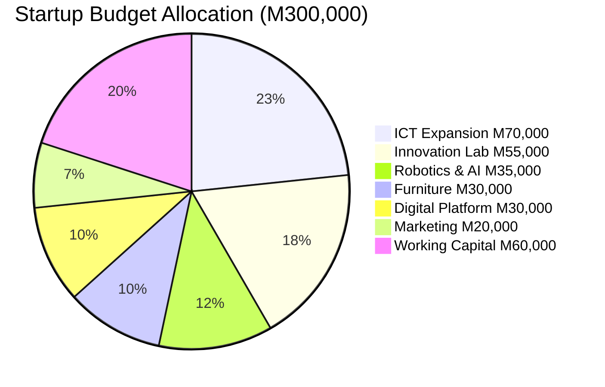

# APPENDIX E: STARTUP BUDGET DETAIL

## Future Stars Academy — Detailed Budget Breakdown

---

## Budget Summary

| Category | Amount (M) | % of Total |
|----------|:----------:|:----------:|
| ICT Expansion | 70,000 | 23.3% |
| Innovation Laboratory Equipment | 55,000 | 18.3% |
| Robotics & AI Kits | 35,000 | 11.7% |
| Furniture & Classroom Setup | 30,000 | 10.0% |
| Digital Platform Development | 30,000 | 10.0% |
| Marketing & Community Outreach | 20,000 | 6.7% |
| Working Capital (3-month buffer) | 60,000 | 20.0% |
| **TOTAL** | **300,000** | **100%** |

---

## 1. ICT Expansion — M70,000

| Item | Qty | Unit Cost (M) | Total (M) | Notes |
|------|:---:|:------------:|:---------:|-------|
| Desktop Computer (Core i5) | 5 | 7,000 | 35,000 | Student workstations |
| Entry-Level Server | 1 | 12,000 | 12,000 | File storage, LMS hosting |
| Backup Power System | 1 | 8,000 | 8,000 | UPS + battery |
| Network Switch (24-port PoE) | 1 | 3,500 | 3,500 | Lab networking |
| Wi-Fi Access Point (Business) | 2 | 1,500 | 3,000 | Extended coverage |
| Cable Management & Accessories | 1 | 2,500 | 2,500 | Structured cabling |
| Printer (Colour Laser) | 1 | 4,000 | 4,000 | Student project prints |
| Surge Protection (Whole-Lab) | 1 | 2,000 | 2,000 | Power protection |
| **Subtotal** | | | **70,000** | |

---

## 2. Innovation Laboratory Equipment — M55,000

| Item | Qty | Unit Cost (M) | Total (M) | Notes |
|------|:---:|:------------:|:---------:|-------|
| Electronics Workbench (with ESD) | 2 | 6,000 | 12,000 | Soldering & assembly |
| 3D Printer (FDM, Entry-Level) | 1 | 10,000 | 10,000 | Prototyping |
| Soldering Stations | 5 | 1,500 | 7,500 | Electronics lab |
| Multimeters & Test Equipment | 5 | 800 | 4,000 | Measurement |
| Oscilloscope (Entry-Level) | 1 | 4,000 | 4,000 | Advanced electronics |
| Power Supply Units (Bench) | 3 | 1,200 | 3,600 | Lab power |
| Tool Kit (Electronics) | 5 | 500 | 2,500 | Basic tools |
| Storage Cabinets & Organizers | 2 | 2,500 | 5,000 | Component storage |
| Safety Equipment (Goggles, etc.) | 10 | 200 | 2,000 | Lab safety |
| Project Display Boards | 5 | 1,000 | 5,000 | Showcase projects |
| **Subtotal** | | | **55,000** | |

---

## 3. Robotics & AI Kits — M35,000

| Item | Qty | Unit Cost (M) | Total (M) | Notes |
|------|:---:|:------------:|:---------:|-------|
| Arduino Starter Kits (Advanced) | 10 | 800 | 8,000 | Microcontroller learning |
| Raspberry Pi Kits (4GB) | 10 | 1,200 | 12,000 | Computing projects |
| Sensor Modules Kits | 10 | 500 | 5,000 | Temperature, motion, etc. |
| Motor & Driver Kits | 10 | 400 | 4,000 | Robotics movement |
| AI Software Licenses (Education) | 1 | 3,000 | 3,000 | AI platform access |
| Robotics Chassis Kits | 5 | 600 | 3,000 | Robot building |
| **Subtotal** | | | **35,000** | |

---

## 4. Furniture & Classroom Setup — M30,000

| Item | Qty | Unit Cost (M) | Total (M) | Notes |
|------|:---:|:------------:|:---------:|-------|
| Modular Student Desks | 10 | 1,200 | 12,000 | Flexible classroom layout |
| Ergonomic Chairs | 15 | 800 | 12,000 | Student seating |
| Instructor Desk & Chair | 1 | 3,000 | 3,000 | Facilitator station |
| Whiteboard (Interactive) | 1 | 3,000 | 3,000 | Teaching |
| **Subtotal** | | | **30,000** | |

---

## 5. Digital Platform Development — M30,000

| Item | Qty | Unit Cost (M) | Total (M) | Notes |
|------|:---:|:------------:|:---------:|-------|
| LMS Software License (1 year) | 1 | 5,000 | 5,000 | Learning management |
| Website Development (Professional) | 1 | 8,000 | 8,000 | Brand + enrolment |
| Mobile App Development (v1) | 1 | 12,000 | 12,000 | Learner engagement |
| Cloud Hosting (1 year) | 1 | 3,000 | 3,000 | Infrastructure |
| Domain & Email Setup | 1 | 2,000 | 2,000 | Professional presence |
| **Subtotal** | | | **30,000** | |

---

## 6. Marketing & Community Outreach — M20,000

| Item | Qty | Unit Cost (M) | Total (M) | Notes |
|------|:---:|:------------:|:---------:|-------|
| Brand Identity Collateral | 1 | 5,000 | 5,000 | Logo, flyers, banners |
| Social Media Campaign (3 months) | 1 | 4,000 | 4,000 | Targeted ads |
| School Visits & Demos (materials) | 10 | 300 | 3,000 | Outreach materials |
| Community Open Day | 1 | 3,000 | 3,000 | Launch event |
| Promotional Items (branded) | 1 | 2,500 | 2,500 | Merchandise |
| Photography & Videography | 1 | 2,500 | 2,500 | Content creation |
| **Subtotal** | | | **20,000** | |

---

## 7. Working Capital — M60,000

| Item | Amount (M) | Notes |
|------|:----------:|-------|
| Rent (3 months) | 18,000 | M6,000/month |
| Staff Stipends (3 months) | 15,000 | Partial team |
| Utilities (3 months) | 3,000 | M1,000/month |
| Internet (3 months) | 3,000 | M1,000/month |
| Learning Materials (initial) | 10,000 | First batch |
| Transport & Logistics (3 months) | 6,000 | M2,000/month |
| Contingency (unforeseen) | 5,000 | Emergency buffer |
| **Subtotal** | **60,000** | |

---

## Budget Allocation Visual

---

## Phased Drawdown Schedule

| Tranche | Month | Amount (M) | Focus |
|:-------:|:-----:|:---------:|-------|
| 1 | M1 | 120,000 | ICT, furniture, facility deposit |
| 2 | M2 | 90,000 | Lab equipment, robotics kits, platform dev |
| 3 | M3 | 50,000 | Marketing launch, learning materials |
| 4 | M4 | 40,000 | Working capital replenishment, contingencies |

---

## Procurement Strategy

- **Local suppliers preferred** (Maseru-based) for furniture, ICT, and consumables
- **Specialized equipment** (3D printer, electronics) sourced from South African suppliers
- **Digital platform** developed locally with oversight from founder
- **Bulk purchasing** for robotics kits to achieve volume discounts
- **3 quotes minimum** for items over M5,000

---

## Budget Monitoring

| Control | Frequency | Responsible |
|---------|:---------:|:-----------:|
| Budget vs Actual Report | Monthly | Founder |
| Procurement Approval (>M2,000) | Per item | Founder |
| Inventory Reconciliation | Quarterly | Operations Lead |
| Financial Audit | Annually | External Auditor |
| Donor/Investor Report | As required | Founder |

---

*All prices quoted in Maloti (M). Exchange rate assumptions: M1 = ZAR1 (pegged). Prices subject to market fluctuation.*
