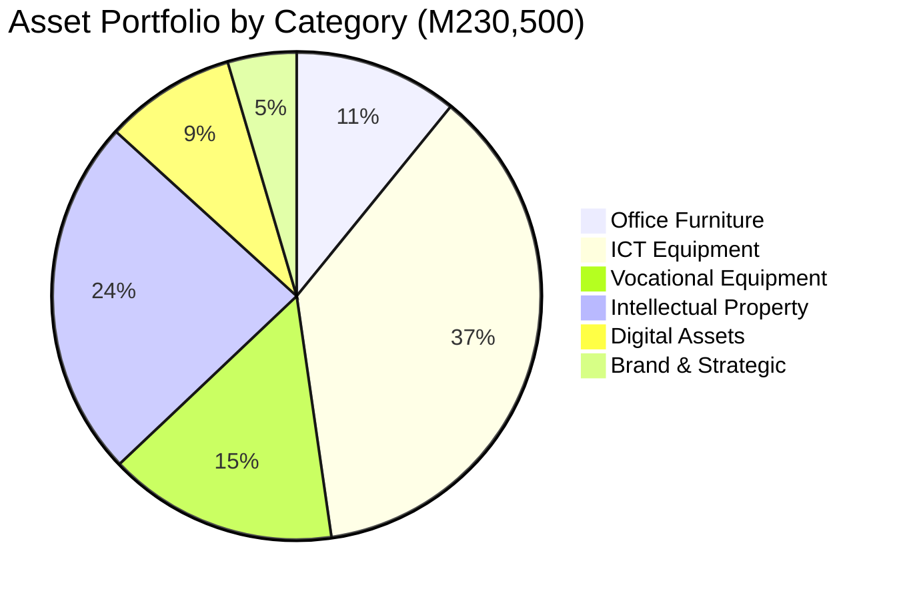

# APPENDIX F: ASSET REGISTER

## Future Stars Academy — Existing Assets as of July 2026

---

## Summary

| Asset Category | Item Count | Total Value (M) | Depreciation Basis |
|----------------|:----------:|:---------------:|:------------------:|
| Office Furniture | 7 | 25,000 | 5-year straight line |
| ICT Equipment | 12 | 85,000 | 3-year straight line |
| Vocational Equipment | 2 | 35,000 | 5-year straight line |
| Intellectual Property | 5 | 55,000 | 10-year amortization |
| Digital Assets | 4 | 20,000 | 5-year amortization |
| Brand & Strategic | 3 | 10,500 | — |
| **TOTAL** | **33** | **230,500** | |

---

## 1. Office Furniture

| # | Asset Description | Quantity | Condition | Purchase Year | Est. Value (M) | Notes |
|:-:|-------------------|:--------:|:---------:|:------------:|:--------------:|-------|
| 1 | Office Desk (Executive) | 1 | Good | 2024-2025 | 5,000 | Founder's office |
| 2 | Office Desk (Standard) | 2 | Good | 2024-2025 | 6,000 | Staff workspace |
| 3 | Office Chair (Executive) | 1 | Good | 2024-2025 | 3,000 | Ergonomic |
| 4 | Office Chair (Standard) | 4 | Good | 2024-2025 | 6,000 | Staff seating |
| 5 | Filing Cabinet (4-drawer) | 2 | Good | 2024-2025 | 3,000 | Document storage |
| 6 | Bookshelf | 1 | Good | 2024-2025 | 1,000 | Resource library |
| 7 | Whiteboard (Large) | 1 | Good | 2024-2025 | 1,000 | Teaching/planning |
| | **Subtotal** | **12** | | | **25,000** | |

---

## 2. ICT Equipment

| # | Asset Description | Quantity | Condition | Purchase Year | Est. Value (M) | Specifications |
|:-:|-------------------|:--------:|:---------:|:------------:|:--------------:|----------------|
| 1 | Desktop Computer | 5 | Good | 2023-2024 | 35,000 | Core i5, 8GB RAM, 256GB SSD |
| 2 | Desktop Computer | 5 | Fair | 2020-2022 | 25,000 | Core i3, 4GB RAM, 500GB HDD |
| 3 | Laser Printer (Multi-function) | 1 | Good | 2024 | 8,000 | Print/Scan/Copy |
| 4 | Network Switch (24-port) | 1 | Good | 2024 | 3,000 | Gigabit |
| 5 | Wi-Fi Router (Business) | 1 | Good | 2024 | 2,000 | Dual-band |
| 6 | UPS (1500VA) | 2 | Good | 2024 | 6,000 | Power backup |
| 7 | External Hard Drive (2TB) | 2 | Good | 2024 | 2,000 | Data backup |
| 8 | Surge Protectors | 5 | Good | 2024 | 1,000 | Power protection |
| 9 | Cabling & Accessories | 1 | Good | 2024 | 3,000 | Network cabling |
| | **Subtotal** | **23** | | | **85,000** | |

---

## 3. Vocational Equipment

| # | Asset Description | Quantity | Condition | Purchase Year | Est. Value (M) | Notes |
|:-:|-------------------|:--------:|:---------:|:------------:|:--------------:|-------|
| 1 | Commercial Oven | 1 | Good | 2024 | 20,000 | Baking & food technology |
| 2 | Commercial Broiler | 1 | Good | 2024 | 15,000 | Food technology |
| | **Subtotal** | **2** | | | **35,000** | |

---

## 4. Intellectual Property

| # | Asset Description | Type | Development Status | Est. Value (M) | Notes |
|:-:|-------------------|:----:|:-----------------:|:--------------:|-------|
| 1 | Future Stars Curriculum | Educational Content | Complete | 25,000 | Full programme syllabi |
| 2 | Innovation Passport Framework | Methodology | Complete | 10,000 | Skills credentialing system |
| 3 | Project-Based Learning Guides | Educational Content | Complete | 8,000 | Facilitator guides |
| 4 | Assessment & Evaluation Tools | Educational Content | Complete | 7,000 | Rubrics, instruments |
| 5 | Research & Development Notes | R&D Output | Complete | 5,000 | Market research, models |
| | **Subtotal** | **5** | | **55,000** | |

---

## 5. Digital Assets

| # | Asset Description | Type | Development Status | Est. Value (M) | Notes |
|:-:|-------------------|:----:|:-----------------:|:--------------:|-------|
| 1 | Digital Platform Framework | Software | Operational | 8,000 | Learning management |
| 2 | Project Management Tools | Software | Operational | 4,000 | Student project tracking |
| 3 | Brand Assets (Logo, Guidelines) | Creative | Complete | 5,000 | Visual identity |
| 4 | Social Media Channels | Digital | Active | 3,000 | Online presence |
| | **Subtotal** | **4** | | **20,000** | |

---

## 6. Brand & Strategic Assets

| # | Asset Description | Type | Status | Est. Value (M) | Notes |
|:-:|-------------------|:----:|:-----:|:--------------:|-------|
| 1 | Business Strategy Document | Strategic | Complete | 4,000 | Roadmap, models |
| 2 | Partnership Research | Research | Complete | 3,000 | Partner database |
| 3 | Market Research Data | Research | Complete | 3,500 | Feasibility data |
| | **Subtotal** | **3** | | **10,500** | |

---

## Total Asset Summary

---

## Condition Assessment

| Condition | Value (M) | % of Total |
|:---------:|:---------:|:----------:|
| Good | 196,500 | 85.2% |
| Fair | 25,000 | 10.8% |
| Needs Replacement | 9,000 | 3.9% |
| **TOTAL** | **230,500** | **100%** |

---

## Assets Needed Post-Funding

| Priority | Asset | Est. Cost (M) | Source |
|:--------:|-------|:------------:|--------|
| Critical | 5 Additional Workstations | 35,000 | ICT Expansion budget |
| Critical | Server & Storage | 15,000 | ICT Expansion budget |
| High | 3D Printer (Entry-level) | 12,000 | Innovation Lab budget |
| High | Robotics Kits (10 units) | 20,000 | Robotics & AI budget |
| High | Electronics Workbench | 18,000 | Innovation Lab budget |
| Medium | Modular Classroom Furniture | 30,000 | Furniture budget |
| Medium | Soldering Stations (5 units) | 7,500 | Innovation Lab budget |
| Medium | Arduino & Raspberry Pi Kits | 15,000 | Robotics & AI budget |
| Low | Sensor Kits & Components | 8,000 | Robotics & AI budget |
| Low | Test Equipment (Multimeters, etc.) | 5,500 | Innovation Lab budget |

---

*This register should be updated quarterly and verified annually by an independent party.*
