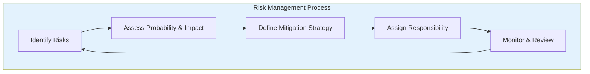
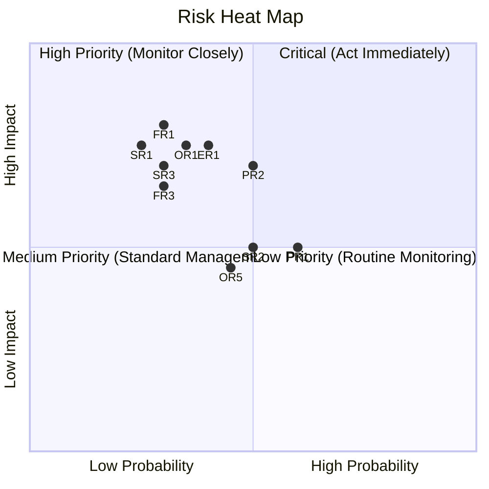

# APPENDIX G: RISK MANAGEMENT PLAN

## Future Stars Academy

---

## 1. Risk Management Framework

### Risk Rating Matrix

| Impact ↓ Probability → | Low (1) | Medium (2) | High (3) |
|:---------------------:|:-------:|:----------:|:--------:|
| **High (3)** | Medium (3) | High (6) | Critical (9) |
| **Medium (2)** | Low (2) | Medium (4) | High (6) |
| **Low (1)** | Low (1) | Low (2) | Medium (3) |

**Risk Score = Probability × Impact**

---

## 2. Risk Register

### 2.1 Strategic Risks

| ID | Risk Description | Probability | Impact | Score | Mitigation Strategy | Owner |
|:--:|-----------------|:----------:|:-----:|:----:|---------------------|:-----:|
| SR1 | Insufficient enrolment to achieve sustainability | Medium | High | 6 | Flexible pricing, multiple revenue streams, aggressive school partnerships, scholarship fund from grants | Founder |
| SR2 | Competitor launches similar programme | Medium | Medium | 4 | Continuous curriculum innovation, strong brand building, community lock-in through Innovation Passport, first-mover advantage | Founder |
| SR3 | Partnership agreements fail to materialize | Medium | High | 6 | Diversified partnership pipeline, value-proposition-driven negotiations, MOUs before launch | Founder |
| SR4 | Reputation damage from poor programme outcomes | Low | High | 3 | Quality assurance framework, facilitator training, continuous assessment, feedback loops | Programme Lead |

### 2.2 Operational Risks

| ID | Risk Description | Probability | Impact | Score | Mitigation Strategy | Owner |
|:--:|-----------------|:----------:|:-----:|:----:|---------------------|:-----:|
| OR1 | Key person dependency on founder | Medium | High | 6 | Document all processes, recruit deputy, build management team, cross-train staff | Founder |
| OR2 | Staff turnover or retention challenges | Low | Medium | 2 | Competitive compensation, professional development, positive culture, performance incentives | Founder |
| OR3 | Facility issues (lease termination, damage) | Low | Medium | 2 | Insurance, maintenance fund, flexible space agreements, backup location options | Operations Lead |
| OR4 | Equipment theft or damage | Low | Medium | 2 | Insurance, security system, asset register, access controls | Operations Lead |
| OR5 | Technology failure (internet, power) | Medium | Medium | 4 | UPS backup, generator plan, offline-capable learning materials, mobile data redundancy | ICT Lead |

### 2.3 Financial Risks

| ID | Risk Description | Probability | Impact | Score | Mitigation Strategy | Owner |
|:--:|-----------------|:----------:|:-----:|:----:|---------------------|:-----:|
| FR1 | Funding shortfall or delayed disbursement | Medium | High | 6 | Multiple funders in pipeline, working capital buffer (M60,000), phased spending, lean operations | Founder |
| FR2 | Currency fluctuation or inflation | Medium | Medium | 4 | Local currency revenue, annual fee adjustments, cost-indexed pricing | Finance Lead |
| FR3 | Cash flow gaps during off-peak periods | Medium | High | 6 | Diversified revenue streams, payment plans for parents, corporate training during school holidays | Finance Lead |
| FR4 | Parent payment defaults | Low | Medium | 2 | Pre-payment options, termly billing, flexible payment plans, scholarship fund | Finance Lead |

### 2.4 Programme Risks

| ID | Risk Description | Probability | Impact | Score | Mitigation Strategy | Owner |
|:--:|-----------------|:----------:|:-----:|:----:|---------------------|:-----:|
| PR1 | Curriculum becomes outdated | Medium | Medium | 4 | Annual curriculum review, industry advisory board, partnerships with tech companies | Programme Lead |
| PR2 | Low learner engagement or retention | Medium | High | 6 | Project-based approach maintains engagement, personal mentoring, Innovation Passport gamification | Programme Lead |
| PR3 | Safety incident during activities | Low | High | 3 | Safety protocols, insurance, first-aid trained staff, risk assessments for all activities | Operations Lead |
| PR4 | Inadequate facilitator capacity | Medium | Medium | 4 | Ongoing training, university partnerships for interns, volunteer professionals | Programme Lead |

### 2.5 External Risks

| ID | Risk Description | Probability | Impact | Score | Mitigation Strategy | Owner |
|:--:|-----------------|:----------:|:-----:|:----:|---------------------|:-----:|
| ER1 | Economic downturn affecting household income | Medium | High | 6 | Flexible payment plans, corporate sponsorship of learners, grant-funded scholarships | Founder |
| ER2 | Regulatory or policy changes | Low | Low | 1 | Legal monitoring, government partnerships, compliance-first approach | Founder |
| ER3 | Public health crisis (pandemic, etc.) | Low | High | 3 | Digital platform enables remote learning, hybrid delivery model | ICT Lead |
| ER4 | Natural disaster | Low | Medium | 2 | Insurance, digital backups, remote operations capability | Operations Lead |
| ER5 | Cybersecurity incident | Low | Low | 1 | Cloud security, regular backups, MFA, staff training, security audits | ICT Lead |

---

## 3. Risk Heat Map

### Risk Response by Category

| Risk Score | Category | Response | Review Frequency |
|:----------:|:--------:|----------|:----------------:|
| 9 | Critical | Immediate action required, contingency plan activated | Weekly |
| 6-8 | High | Detailed mitigation plan, assigned owner, regular monitoring | Monthly |
| 3-5 | Medium | Standard controls, periodic review | Quarterly |
| 1-2 | Low | Accept, monitor, low-touch | Bi-annually |

---

## 4. Top 10 Risks — Active Management Register

| Rank | ID | Risk | Score | Action | Review Date |
|:---:|:--:|------|:----:|--------|:----------:|
| 1 | FR1 | Funding shortfall or delayed disbursement | 9 | Maintain working capital, diversify funding pipeline, phased spending | Monthly |
| 2 | SR1 | Insufficient enrolment | 6 | Aggressive school outreach, referral incentives, flexible pricing, payment plans | Monthly |
| 3 | SR3 | Partnership delays | 6 | Build partnership pipeline, value-proposition materials, follow-up schedule | Monthly |
| 4 | OR1 | Key person dependency | 6 | Recruit deputy, document processes, cross-train, build team | Quarterly |
| 5 | FR3 | Cash flow gaps | 6 | Diversified revenue, pre-payment options, corporate training during low seasons | Monthly |
| 6 | PR2 | Low learner engagement | 6 | Engaging curriculum, mentorship, gamification, parent involvement | Quarterly |
| 7 | ER1 | Economic downturn | 6 | Flexible payment, corporate sponsors, grant scholarships | Quarterly |
| 8 | SR2 | Competitor entry | 4 | Continuous innovation, strong brand, community lock-in | Quarterly |
| 9 | OR5 | Technology failure | 4 | UPS, generator, offline materials, mobile data | Monthly |
| 10 | PR1 | Curriculum outdated | 4 | Annual review, industry advisory, continuous updates | Annually |

---

## 5. Contingency & Business Continuity

### 5.1 Financial Contingency

| Scenario | Contingency Amount (M) | Source |
|----------|:---------------------:|--------|
| 3-month revenue shortfall | 60,000 | Working capital from investment |
| Equipment replacement | 20,000 | Insurance + maintenance fund |
| Emergency facility relocation | 15,000 | Reserve fund |
| **Total Contingency** | **95,000** | |

### 5.2 Business Continuity Triggers

| Trigger | Action | Timeline |
|---------|--------|:-------:|
| Revenue < 70% of projection for 2 consecutive months | Cost reduction measures, increased marketing, partner engagement | Within 30 days |
| Enrolment < 25 learners at end of Month 6 | Pricing review, outreach blitz, partnership activation | Within 14 days |
| Loss of key staff member | Interim coverage from trained staff, recruitment initiated | Within 7 days |
| Facility unavailable | Activate backup location, online-only delivery | Within 48 hours |
| Technology infrastructure failure | Switch to offline materials, mobile data | Within 24 hours |

---

## 6. Insurance Requirements

| Insurance Type | Coverage | Est. Annual Premium (M) | Priority |
|----------------|----------|:----------------------:|:--------:|
| Public Liability | M1,000,000 | 5,000 | Critical |
| Equipment & Contents | Replacement value | 8,000 | Critical |
| Business Interruption | 6 months revenue | 4,000 | High |
| Professional Indemnity | M500,000 | 3,000 | Medium |
| Motor Vehicle (if applicable) | Comprehensive | — | As needed |
| Medical/Liability for Camps | Per event | 2,500 | Per camp |

---

## 7. Risk Review Schedule

| Review Type | Frequency | Participants | Output |
|-------------|:---------:|-------------|--------|
| Risk Register Review | Monthly | Founder + Team | Updated risk scores, new risks identified |
| Financial Risk Review | Monthly | Founder + Finance Lead | Cash flow, budget vs actual analysis |
| Programme Risk Review | Quarterly | Programme Lead | Enrolment, retention, quality metrics |
| Strategic Risk Review | Bi-annually | Founder + Advisors | Market position, competition, partnerships |
| Full Risk Audit | Annually | External (recommended) | Comprehensive risk assessment |

---

*This Risk Management Plan should be reviewed and updated monthly during the first year of operations, transitioning to quarterly review from Year 2 onward.*
