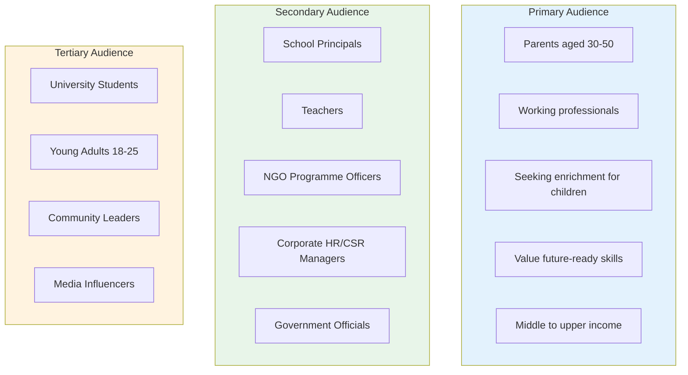
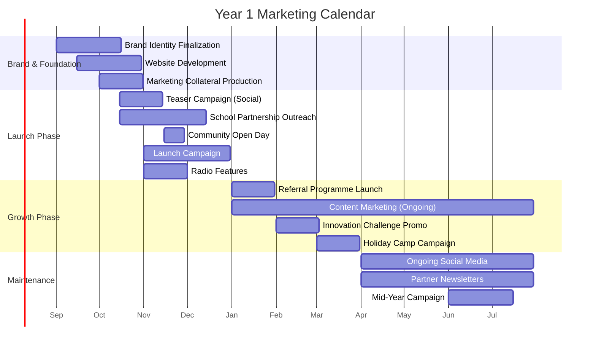
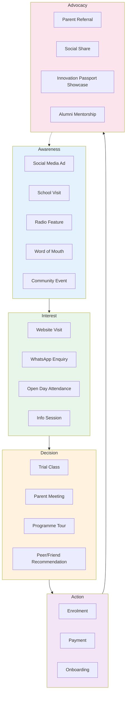

# APPENDIX H: MARKETING STRATEGY

## Future Stars Academy — Go-to-Market & Growth Plan

---

## 1. Marketing Objectives

| Objective | Year 1 Target | Measurement |
|-----------|:------------:|-------------|
| Brand Awareness | 60% of target market in Maseru | Survey, social media analytics |
| Enrolment Pipeline | 200+ qualified leads | CRM tracking |
| School Partnerships | 5 signed MOUs | Partnership agreements |
| Digital Reach | 5,000 social media followers | Platform analytics |
| Community Trust | 90% positive feedback | Parent satisfaction surveys |

---

## 2. Target Audience

---

## 3. Brand Positioning

### Brand Promise

> *"Equipping young people with the skills and mindset to create solutions, build businesses, and transform communities through technology and innovation."*

### Brand Personality

| Trait | Manifestation |
|-------|---------------|
| **Innovative** | Cutting-edge programmes, modern approach |
| **Aspirational** | Inspires learners to dream big |
| **Practical** | Focus on real outcomes, not just theory |
| **Caring** | Personal mentoring, safe environment |
| **Professional** | Quality programmes, skilled facilitators |
| **Community-focused** | Solving real local problems |

### Key Differentiators

| Differentiator | Competitive Advantage |
|----------------|----------------------|
| **Real-World Projects** | Not just coding — learners solve actual community problems |
| **Innovation Passport** | Digital credentialing system that records practical skills |
| **Multiple Disciplines** | AI, software, robotics, engineering, entrepreneurship, vocational |
| **Entrepreneurship Focus** | Every learner creates a business or product |
| **Flexible Model** | After-school, weekends, holidays, online |

---

## 4. Marketing Channels & Tactics

### 4.1 Digital Channels

| Channel | Tactic | Budget (M) | Timeline | KPI |
|---------|--------|:---------:|:--------:|:---:|
| **Facebook** | Targeted ads to parents (30-50), Maseru | 8,000 | Ongoing | Cost per lead < M50 |
| **Instagram** | Learner project showcases, behind-the-scenes | 3,000 | Ongoing | Engagement rate > 5% |
| **WhatsApp** | Parent groups, enquiry automation | 1,000 | Month 3+ | Response time < 1 hour |
| **Website** | SEO-optimized, enrolment portal | Included in platform | Month 4 | Conversion rate > 10% |
| **YouTube** | Project tutorials, success stories | 2,000 | Month 6+ | 1,000+ subscribers |
| **Email** | Newsletter to parent database | 1,000 | Month 4+ | Open rate > 25% |

### 4.2 Offline Channels

| Channel | Tactic | Budget (M) | Timeline | KPI |
|---------|--------|:---------:|:--------:|:---:|
| **School Visits** | Presentations to principals, demo sessions | 3,000 | Month 3-5 | 10 school visits |
| **Community Open Day** | Live demos, parent info session | 3,000 | Month 4 | 100+ attendees |
| **Radio** | Talk show appearance, ad spots | 4,000 | Month 4-6 | 3+ radio features |
| **Flyers & Posters** | Distribution at schools, community centres | 2,000 | Month 4-5 | 5,000 distributed |
| **Referral Programme** | Existing parents refer friends (discount) | 1,000 | Month 6+ | 20% of enrolments |
| **Corporate Presentations** | HR/CSR departments | 1,000 | Month 5+ | 3 corporate partnerships |

---

## 5. Marketing Calendar (Year 1)

---

## 6. Customer Journey & Conversion Funnel

### Funnel Metrics

| Stage | Target (Year 1) | Conversion Rate |
|-------|:--------------:|:---------------:|
| Reach (Awareness) | 50,000 people | — |
| Engaged (Interest) | 2,000 people | 4% |
| Trial/Visit (Decision) | 200 people | 10% |
| Enrolled (Action) | 40 learners | 20% |
| Referral (Advocacy) | 8 referrals | 20% of enrolled |

---

## 7. Marketing Budget Allocation (Year 1)

| Category | Amount (M) | % of Marketing Budget |
|----------|:---------:|:--------------------:|
| Digital Advertising | 12,000 | 24% |
| Print & Collateral | 8,000 | 16% |
| Events & Open Days | 6,000 | 12% |
| School Outreach | 6,000 | 12% |
| Radio & Media | 5,000 | 10% |
| Content Production | 5,000 | 10% |
| Promotional Items | 3,000 | 6% |
| Website & SEO | 2,000 | 4% |
| Photography/Videography | 3,000 | 6% |
| **TOTAL** | **50,000** | **100%** |

*Note: M20,000 from startup budget + M30,000 from operating budget*

---

## 8. Competitive Positioning

| Competitor Type | Example | Differentiation Strategy |
|-----------------|---------|--------------------------|
| **Tuition Centres** | Local after-school tutoring | Future Stars offers practical skills, not academic tutoring |
| **Coding Schools** | Online platforms | In-person mentoring, community projects, entrepreneurship |
| **Vocational Colleges** | TVET institutions | Younger audience (10-18), innovation focus, lower commitment |
| **Innovation Hubs** | Adult-focused hubs | Age-appropriate programmes, educational focus |
| **School Programmes** | Government ICT | More advanced, technology-driven, entrepreneurial |

---

## 9. Key Messaging

### For Parents

> *"Give your child the skills to thrive in a future powered by AI and technology. At Future Stars Academy, your child doesn't just learn to code — they learn to build, innovate, and create real solutions for real problems."*

### For Schools

> *"Partner with Future Stars Academy to bring innovation education to your students. We complement your curriculum with practical AI, coding, robotics, and entrepreneurship programmes."*

### For Sponsors/Investors

> *"Invest in the next generation of innovators. Future Stars Academy is building Lesotho's future workforce — one project at a time."*

---

## 10. Success Measurement

| KPI | Tool | Target | Review |
|-----|:----:|:-----:|:------:|
| Website Visitors | Google Analytics | 5,000/mo | Monthly |
| Social Media Followers | Native Analytics | 5,000 | Monthly |
| Enrolment Leads | CRM | 200+ | Weekly |
| Conversion Rate | CRM | 20% | Monthly |
| Cost per Enrolment | Financial Records | < M2,000 | Quarterly |
| Parent Satisfaction | Survey | 90%+ | Termly |
| Brand Recall | Survey | 60% | Bi-annually |

---

*This marketing strategy should be reviewed quarterly, with tactical adjustments based on channel performance data.*
