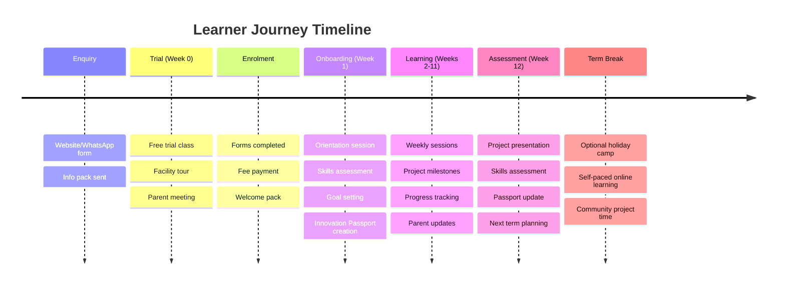
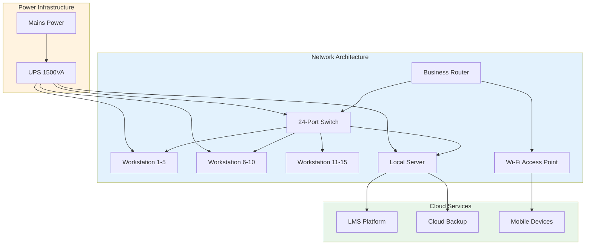

# APPENDIX I: OPERATIONAL PLAN

## Future Stars Academy — Day-to-Day Operations & Logistics

---

## 1. Operating Model

### Core Operating Hours

| Day | Time | Activity |
|:---:|:----:|----------|
| **Monday - Friday** | 14:00 - 17:00 | After-school programmes (Age 10-14) |
| **Monday - Friday** | 17:00 - 19:00 | After-school programmes (Age 15-18) |
| **Saturday** | 09:00 - 13:00 | Saturday Innovation Academy |
| **Saturday** | 14:00 - 17:00 | Entrepreneurship & Mentorship |
| **School Holidays** | 08:00 - 16:00 | Holiday Innovation Camps |
| **Online** | Flexible | Self-paced + live sessions |

### Term Structure

| Term | Months | Duration | Focus |
|:----:|:------:|:--------:|-------|
| Term 1 | Feb - Apr | 12 weeks | Foundation & Skill Building |
| Term 2 | May - Jul | 12 weeks | Project Development |
| Term 3 | Aug - Oct | 12 weeks | Advanced Projects & Competition Prep |
| Term 4 | Nov - Dec | 8 weeks | Innovation Expo & Portfolio Review |
| Holiday Camp 1 | April | 1-2 weeks | Intensive Boot Camp |
| Holiday Camp 2 | July | 1-2 weeks | Intensive Boot Camp |
| Holiday Camp 3 | December | 1-2 weeks | Innovation Showcase Camp |

---

## 2. Daily Operations Flow

```mermaid
flowchart TB
    subgraph PRE[Pre-Session Preparation]
        P1[Facility Setup<br/>8:00-9:00 / 13:00-14:00]
        P2[Equipment Check<br/>All hardware tested]
        P3[Lesson Prep<br/>Facilitator review]
        P4[Attendance &<br/>Registration]
    end
    
    subgraph SESSION[Session Delivery]
        S1[Welcome &<br/>Check-in (10 min)]
        S2[Concept Introduction<br/>(20-30 min)]
        S3[Hands-On Project Work<br/>(60-90 min)]
        S4[Review & Reflection<br/>(15-20 min)]
        S5[Innovation Passport<br/>Update (5-10 min)]
    end
    
    subgraph POST[Post-Session]
        PT1[Equipment Cleanup<br/>& Storage]
        PT2[Incident Report<br/>If needed]
        PT3[Learner Progress<br/>Tracking]
        PT4[Parent Update<br/>Communication]
    end
    
    PRE --> SESSION --> POST
    
    style PRE fill:#fff3e0,color:#333
    style SESSION fill:#e3f2fd,color:#333
    style POST fill:#e8f5e9,color:#333
```

---

## 3. Learner Journey & Touchpoints



---

## 4. Facility Requirements

### Space Allocation

| Space | Size | Purpose | Equipment |
|-------|:----:|---------|-----------|
| Computer Lab | 30 m² | Coding, AI, digital media | 15 workstations, server, projector |
| Innovation Lab | 25 m² | Electronics, robotics, 3D printing | Workbenches, soldering stations, 3D printer |
| Vocational Lab | 20 m² | Baking, food tech, fashion | Oven, broiler, sewing machine |
| Workshop Space | 20 m² | Group activities, entrepreneurship | Whiteboards, modular furniture |
| Reception/Office | 15 m² | Admin, parent meetings | Desk, filing, waiting area |
| Storage | 10 m² | Equipment, materials | Shelving, secure cabinets |
| **TOTAL** | **120 m²** | | |

### Facility Requirements Checklist

| Requirement | Status | Notes |
|-------------|:------:|-------|
| Adequate power supply (UPS/generator) | Needed | Backup essential for ICT |
| High-speed internet (20+ Mbps) | Needed | Fibre preferred |
| Security system | Needed | Cameras, alarm |
| Fire safety equipment | Needed | Extinguishers, exits |
| First aid kit | Needed | Fully stocked |
| Accessible (wheelchair) | Desirable | Future requirement |
| Climate control | Desirable | Fans/AC for lab equipment |

---

## 5. Staff Schedule (Weekly)

| Time | Monday | Tuesday | Wednesday | Thursday | Friday | Saturday |
|:----:|:------:|:-------:|:---------:|:--------:|:------:|:--------:|
| **AM** | Admin | Planning | Outreach | Admin | Team Meeting | SIA Prep |
| **14:00-15:00** | Junior Grp 1 | Junior Grp 2 | Junior Grp 3 | Junior Grp 4 | Project Clinic | SIA Session 1 |
| **15:00-16:00** | Junior Grp 1 | Junior Grp 2 | Junior Grp 3 | Junior Grp 4 | Project Clinic | SIA Session 2 |
| **16:00-17:00** | Break/Setup | Break/Setup | Break/Setup | Break/Setup | Break/Setup | Lunch |
| **17:00-18:00** | Senior Grp 1 | Senior Grp 2 | Senior Grp 3 | Senior Grp 4 | Innovation Club | Mentorship |
| **18:00-19:00** | Senior Grp 1 | Senior Grp 2 | Senior Grp 3 | Senior Grp 4 | Innovation Club | Mentorship |

---

## 6. Supply Chain & Procurement

### Key Consumables (Monthly)

| Item | Quantity | Est. Cost (M) | Supplier Type |
|------|:--------:|:------------:|---------------|
| Printing paper | 5 reams | 500 | Local stationer |
| Electronics components | As needed | 1,500 | Electronics supplier |
| Baking ingredients | Per workshop | 1,000 | Local grocery |
| Stationery | As needed | 500 | Local stationer |
| Cleaning supplies | Monthly | 300 | Local supplier |
| Refreshments | Per session | 500 | Local grocery |

### Equipment Maintenance Schedule

| Equipment | Frequency | Activity | Est. Cost (M/year) |
|-----------|:---------:|----------|:------------------:|
| Desktop Computers | Monthly | Software updates, cleaning | 6,000 |
| Printer | Weekly | Cleaning, ink replacement | 3,000 |
| Network Equipment | Quarterly | Firmware updates, testing | 1,000 |
| 3D Printer | Per use | Calibration, maintenance | 2,000 |
| Oven/Broiler | Monthly | Deep cleaning, safety check | 1,500 |
| Electronics Kits | Termly | Inventory, replace damaged | 3,000 |

---

## 7. Health, Safety & Safeguarding

### Safety Protocols

| Area | Protocol | Response |
|------|----------|----------|
| Fire | Monthly drill, clear exits, extinguisher locations | Evacuation, emergency services |
| Electrical | Regular inspection, no overloaded sockets | Disconnect, qualified electrician |
| First Aid | Trained staff on site, fully stocked kit | Immediate care, hospital if needed |
| Equipment Safety | Induction for all equipment, supervision | Incident report, equipment review |
| Child Safeguarding | Code of conduct, DBS checks, supervision ratios | Reporting, support, escalation |

### Staff-to-Learner Ratios

| Activity Type | Ratio | Supervision Level |
|---------------|:----:|:-----------------:|
| Computer Lab | 1:10 | General |
| Electronics/Robotics | 1:8 | Close |
| Vocational (oven, tools) | 1:6 | Direct |
| Off-site/Field Work | 1:5 | Direct |
| Online Session | 1:15 | Moderated |

---

## 8. Technology Infrastructure



---

## 9. Transport & Logistics

| Need | Solution | Cost (M/month) |
|------|----------|:--------------:|
| Staff transport | Personal arrangement + allowance | 2,000 |
| Equipment transport | Occasional hire | 500 |
| Outreach visits | Public transport + allowance | 1,000 |
| Supply pickup | Local delivery included | Included |

---

## 10. Insurance Coverage

| Insurance Type | Provider | Coverage | Annual Premium (M) |
|----------------|:--------:|----------|:------------------:|
| Public Liability | TBD | M1,000,000 | 5,000 |
| Equipment & Contents | TBD | Replacement value | 8,000 |
| Business Interruption | TBD | 6 months | 4,000 |
| Professional Indemnity | TBD | M500,000 | 3,000 |

---

*This operational plan will be refined during the first quarter based on practical experience. All protocols will be documented in a comprehensive Operations Manual by Month 3.*
