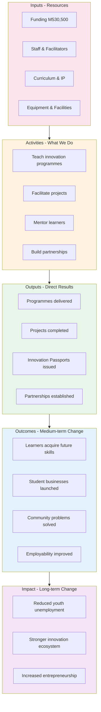
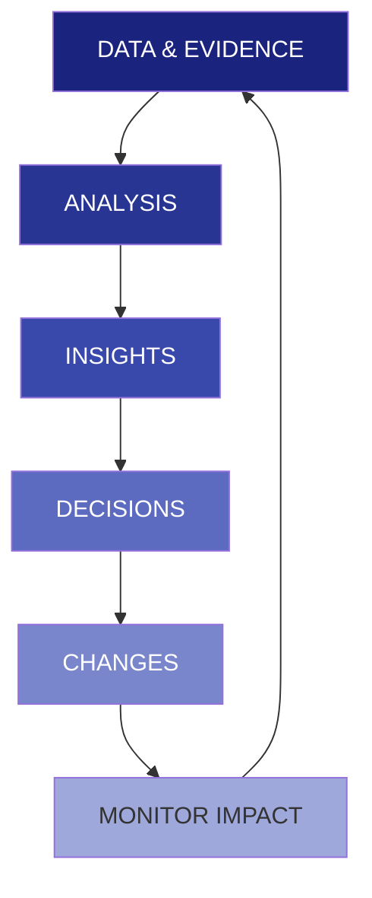

# APPENDIX J: MONITORING & EVALUATION FRAMEWORK

## Future Stars Academy — Measuring Impact & Performance

---

## 1. M&E Philosophy

Future Stars Academy adopts a **results-based monitoring and evaluation** approach that measures not just activities and outputs, but **outcomes and long-term impact** on learners, communities, and the innovation ecosystem.

---

## 2. Logical Framework (LogFrame)

---

## 3. Indicator Matrix

### 3.1 Input Indicators

| Indicator | Baseline | Target (Year 1) | Data Source | Frequency |
|-----------|:--------:|:--------------:|-------------|:---------:|
| Total investment mobilized | M230,500 | M530,500 | Financial records | Monthly |
| Staff recruited | 1 | 4-6 | HR records | Monthly |
| Curriculum modules complete | 12 | 24 | Curriculum inventory | Quarterly |
| Equipment available | 33 items | 45+ items | Asset register | Quarterly |

### 3.2 Activity Indicators

| Indicator | Target (Year 1) | Data Source | Frequency |
|-----------|:--------------:|-------------|:---------:|
| Programme sessions delivered | 400+ | Attendance records | Weekly |
| Mentorship hours provided | 500+ | Mentor logs | Monthly |
| School partnerships active | 5 | Partnership files | Quarterly |
| Marketing events held | 10+ | Event calendar | Quarterly |
| Community outreach contacts | 2,000+ | CRM | Monthly |

### 3.3 Output Indicators

| Indicator | Year 1 | Year 2 | Year 3 | Data Source |
|-----------|:------:|:------:|:------:|-------------|
| Learners enrolled | 40 | 80 | 150 | Enrolment system |
| Innovation Passports issued | 40 | 80 | 150 | Digital platform |
| Projects completed | 15 | 45 | 100 | Project database |
| Student businesses launched | 5 | 15 | 30 | Business registry |
| Partner schools | 5 | 15 | 25 | MOU file |
| Digital platform users | 500 | 2,000 | 5,000 | Analytics |

### 3.4 Outcome Indicators

| Indicator | Year 1 | Year 2 | Year 3 | Data Source |
|-----------|:------:|:------:|:------:|-------------|
| Learner retention rate | 80% | 85% | 90% | Enrolment system |
| Skills assessment pass rate | 85% | 90% | 95% | Assessment records |
| Female participation rate | 50% | 50% | 50% | Enrolment data |
| Parent satisfaction rate | 85% | 90% | 95% | Survey |
| Student business survival (6mo) | 75% | 80% | 85% | Business tracking |
| Learners progressing to next level | 70% | 75% | 80% | Learning records |

### 3.5 Impact Indicators

| Indicator | 3-Year Target | Measurement Method |
|-----------|:------------:|-------------------|
| Jobs created through student ventures | 50 | Business surveys |
| People reached through community projects | 5,000 | Project impact reports |
| Innovation Passports recognized by employers | 10+ employers | Employer survey |
| Alumni in tech/entrepreneurship careers | TBD (Year 5) | Alumni tracking |
| Community problems solved (documented) | 100 | Project database |

---

## 4. Data Collection Tools

```mermaid
flowchart LR
    subgraph TOOLS[Data Collection Tools]
        T1[Enrolment<br/>System]
        T2[Learning<br/>Analytics]
        T3[Facilitator<br/>Assessments]
        T4[Parent<br/>Surveys]
        T5[Project<br/>Reports]
        T6[Financial<br/>Records]
    end
    
    subgraph DB[Central Database]
        D1[Learner Data]
        D2[Attendance]
        D3[Assessment Scores]
        D4[Project Impact]
        D5[Financial Data]
    end
    
    subgraph REPORTS[Reporting]
        R1[Monthly Dashboard]
        R2[Quarterly Report]
        R3[Annual Impact Report]
        R4[Donor Reports]
    end
    
    TOOLS --> DB
    DB --> REPORTS
    
    style TOOLS fill:#e8f5e9,color:#333
    style DB fill:#e3f2fd,color:#333
    style REPORTS fill:#f3e5f5,color:#333
```

---

## 5. Reporting Schedule

| Report Type | Audience | Frequency | Content |
|-------------|----------|:---------:|---------|
| **Monthly Dashboard** | Management | Monthly | Key metrics, budget vs actual, issues |
| **Learner Progress Report** | Parents | Termly | Skills achieved, projects, passport update |
| **Quarterly Programme Report** | Board, Partners | Quarterly | Activities, outputs, challenges, adjustments |
| **Financial Report** | Management, Board | Monthly | Income, expenses, cash flow |
| **Annual Impact Report** | All stakeholders | Annually | Comprehensive impact, stories, financial statements |
| **Donor/Investor Report** | Specific funders | As agreed | Custom indicators, outcomes, case studies |

---

## 6. Evaluation Plan

### 6.1 Internal Evaluations

| Evaluation | Timing | Method | Purpose |
|------------|:------:|--------|---------|
| **Monthly Review** | Monthly | Team meeting + data review | Operational adjustments |
| **Mid-Year Review** | Month 6 | Full data analysis, stakeholder feedback | Strategic adjustments |
| **Annual Self-Evaluation** | Year end | Comprehensive review against all KPIs | Learning, planning |

### 6.2 External Evaluations

| Evaluation | Timing | Method | Purpose |
|------------|:------:|--------|---------|
| **Baseline Study** | Month 2 | External consultant | Benchmark learner skills, community context |
| **Mid-Term Evaluation** | Month 18 | External evaluator | Assess progress, recommend changes |
| **End-of-Phase Evaluation** | Year 3 | External evaluator | Comprehensive impact assessment |
| **Social Return on Investment** | Year 3 | SROI methodology | Quantify social value created |

---

## 7. Quality Assurance Framework

| Area | Standard | Verification Method | Frequency |
|------|:--------:|---------------------|:---------:|
| **Curriculum Quality** | Aligned with industry standards | Expert review | Annually |
| **Teaching Quality** | 80%+ facilitator assessment score | Observation, learner feedback | Termly |
| **Learner Safety** | Full safeguarding compliance | Audit, incident log | Monthly |
| **Financial Management** | Clean audit | External audit | Annually |
| **Data Privacy** | GDPR-equivalent standards | Data audit | Quarterly |
| **Impact Reporting** | Verify 20% of reported outcomes | Spot-check visits | Quarterly |

---

## 8. Learning & Adaptation

### Feedback Loop Mechanisms

| Mechanism | Description | Frequency |
|-----------|-------------|:---------:|
| **Learner Feedback Sessions** | Structured feedback on programmes | Termly |
| **Parent Forums** | Roundtable discussions | Quarterly |
| **Facilitator Reflection** | Peer learning and improvement | Monthly |
| **Stakeholder Workshops** | Partners review and input | Bi-annually |
| **M&E Reflection Days** | Team reviews data, identifies lessons | Quarterly |

---

## 9. M&E Budget (Year 1)

| Item | Cost (M) | Notes |
|------|:-------:|-------|
| M&E System Development | 5,000 | Digital data collection tools |
| Baseline Study | 8,000 | External consultant |
| Surveys & Data Collection | 3,000 | Printing, transport |
| Reporting & Communication | 2,000 | Design, printing |
| Staff Training on M&E | 2,000 | Capacity building |
| **TOTAL** | **20,000** | |

---

*This M&E Framework will be refined during the first quarter of operations based on practical experience and stakeholder input. A full M&E manual with detailed tools and protocols will be developed by Month 3.*
