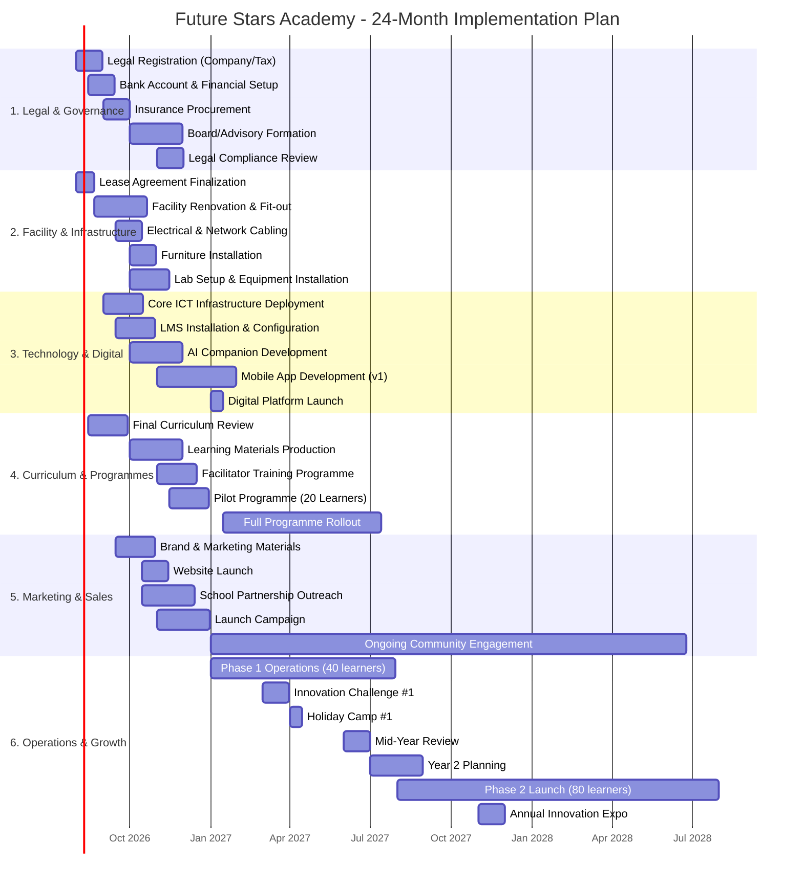

# APPENDIX K: 24-MONTH IMPLEMENTATION GANTT CHART

## Future Stars Academy

---

## Visual Implementation Timeline

---

## Phase Breakdown

### Phase 1: Foundation (Months 1-3 | Aug - Oct 2026)

| Task | Start | End | Duration | Owner | Dependencies |
|------|:-----:|:---:|:--------:|:-----:|:------------:|
| Legal Registration | 01-Aug-26 | 30-Aug-26 | 30 days | Founder | None |
| Lease Agreement | 01-Aug-26 | 21-Aug-26 | 21 days | Founder | None |
| Facility Renovation | 22-Aug-26 | 22-Oct-26 | 60 days | Founder | Lease signed |
| Bank Account Setup | 15-Aug-26 | 15-Sep-26 | 30 days | Founder | Legal registration |
| Insurance Procurement | 01-Sep-26 | 01-Oct-26 | 30 days | Founder | Legal registration |
| Core ICT Deployment | 01-Sep-26 | 15-Oct-26 | 45 days | ICT Lead | Facility ready |
| Final Curriculum Review | 15-Aug-26 | 30-Sep-26 | 45 days | Programme Lead | None |
| Curriculum Materials Production | 01-Oct-26 | 30-Nov-26 | 60 days | Programme Lead | Curriculum review done |
| **Milestone: Facility Ready** | **22-Oct-26** | | | | |

### Phase 2: Pilot & Launch (Months 4-6 | Nov 2026 - Jan 2027)

| Task | Start | End | Duration | Owner | Dependencies |
|------|:-----:|:---:|:--------:|:-----:|:------------:|
| Facilitator Recruitment | 01-Oct-26 | 15-Nov-26 | 45 days | Founder | Curriculum ready |
| Facilitator Training | 01-Nov-26 | 15-Dec-26 | 45 days | Programme Lead | Staff recruited |
| LMS Configuration | 15-Sep-26 | 30-Oct-26 | 45 days | ICT Lead | ICT deployed |
| Brand Materials Production | 15-Sep-26 | 30-Oct-26 | 45 days | Founder | None |
| School Partnership Outreach | 15-Oct-26 | 15-Dec-26 | 60 days | Founder | Brand materials ready |
| Launch Campaign | 01-Nov-26 | 31-Dec-26 | 60 days | Founder | Brand ready |
| Website Launch | 15-Oct-26 | 15-Nov-26 | 30 days | ICT Lead | Brand ready |
| Pilot Programme (20 learners) | 15-Nov-26 | 31-Dec-26 | 45 days | Programme Lead | All above |
| Open Day & Community Event | 01-Dec-26 | 15-Dec-26 | 14 days | Founder | Facility ready |
| **Milestone: Pilot Complete** | **31-Dec-26** | | | | |

### Phase 3: Full Operations (Months 7-12 | Jan - Jul 2027)

| Task | Start | End | Duration | Owner | Dependencies |
|------|:-----:|:---:|:--------:|:-----:|:------------:|
| Full Programme Rollout | 15-Jan-27 | 15-Jul-27 | 180 days | Programme Lead | Pilot complete |
| Digital Platform Launch | 01-Jan-27 | 15-Jan-27 | 14 days | ICT Lead | Tech ready |
| Innovation Challenge #1 | 01-Mar-27 | 31-Mar-27 | 30 days | Programme Lead | Operations stable |
| Holiday Camp #1 | 01-Apr-27 | 14-Apr-27 | 14 days | Programme Lead | Operations stable |
| Parent Engagement Forum | 15-Mar-27 | 22-Mar-27 | 7 days | Founder | Operations stable |
| Mobile App v1 Launch | 01-Feb-27 | 28-Feb-27 | 28 days | ICT Lead | App development |
| Mid-Year Review | 01-Jun-27 | 30-Jun-27 | 30 days | Founder + Team | 6 months data |
| **Milestone: Breakeven Target** | **28-Feb-27** | | | | |
| **Milestone: Year 1 Target (40 learners)** | **30-Jun-27** | | | | |

### Phase 4: Growth & Scale (Months 13-24 | Aug 2027 - Jul 2028)

| Task | Start | End | Duration | Owner | Dependencies |
|------|:-----:|:---:|:--------:|:-----:|:------------:|
| Year 2 Planning | 01-Jul-27 | 31-Aug-27 | 60 days | Founder | Year 1 data |
| Phase 2 Launch (80 learners) | 01-Aug-27 | 31-Jul-28 | 365 days | All | Year 2 plan |
| Corporate Training Launch | 01-Oct-27 | 30-Nov-27 | 60 days | Founder | Capacity ready |
| Rural Outreach Programme | 01-Jan-28 | 30-Jun-28 | 180 days | Founder | Year 2 stable |
| Innovation Expo 2027 | 01-Nov-27 | 30-Nov-27 | 30 days | Programme Lead | Year 1 projects |
| New Programme Development | 01-Sep-27 | 30-Nov-27 | 90 days | Programme Lead | Market feedback |
| Partnership MOUs Formalized | 01-Oct-27 | 31-Jan-28 | 120 days | Founder | Trust built |
| Year 2 Mid-Year Review | 01-Jan-28 | 31-Jan-28 | 30 days | Founder + Team | First half data |
| Year 3 Planning | 01-May-28 | 30-Jun-28 | 60 days | Founder | Year 2 data |
| **Milestone: Year 2 Target (80 learners)** | **30-Jun-28** | | | | |
| **Milestone: 5 School Partners** | **31-Dec-27** | | | | |

---

## Critical Path Analysis

**Critical Path:** Legal → Lease → Renovation → Lab Setup → Pilot → Full Rollout

**Estimated Critical Path Duration:** 5.5 months (Aug 2026 - mid-Jan 2027)

---

## Key Dependencies & Risks

| Dependency | Risk | Buffer | Mitigation |
|------------|:----:|:-----:|------------|
| Lease → Renovation | Delay in lease approval | 21 days | Multiple property options in pipeline |
| Renovation → Lab Setup | Construction delays | 14 days | Phased fit-out, priority to core teaching area |
| Lab Setup → Pilot | Equipment delivery delays | 14 days | Pre-order critical equipment, local suppliers first |
| Recruitment → Training | Low applicant pool | 21 days | Start recruitment early, use university partnerships |
| Pilot → Full Rollout | Low pilot success | 30 days | Continuous pilot assessment, rapid adjustments |

---

## Resource Allocation (Year 1)

| Resource Type | Aug-Dec 2026 | Jan-Jul 2027 |
|---------------|:----------:|:----------:|
| Founder (FTE) | 100% | 100% |
| Programme Lead (FTE) | 50% (recruit Oct) | 100% |
| ICT Lead (Part-time) | 25% | 50% |
| Facilitators (Part-time) | — | 3 @ 25% each |
| Admin Support (Part-time) | 25% | 50% |
| Volunteers/Mentors | 2-3 | 5-8 |

---

*This Gantt chart should be reviewed monthly, with actual progress compared to planned milestones. Adjustments should be documented with rationale and revised timelines.*
