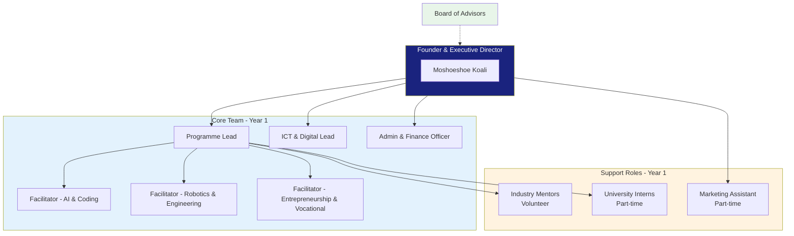
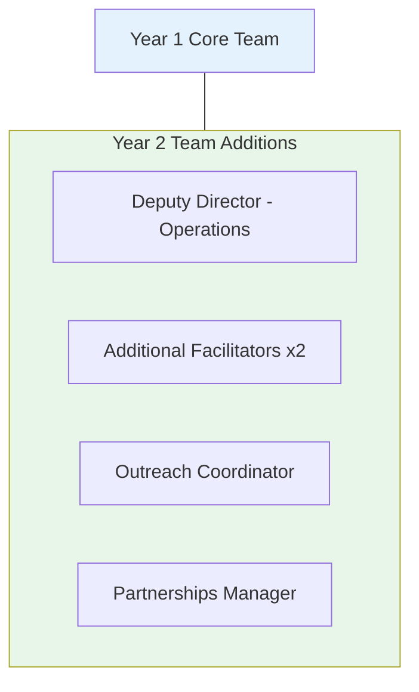
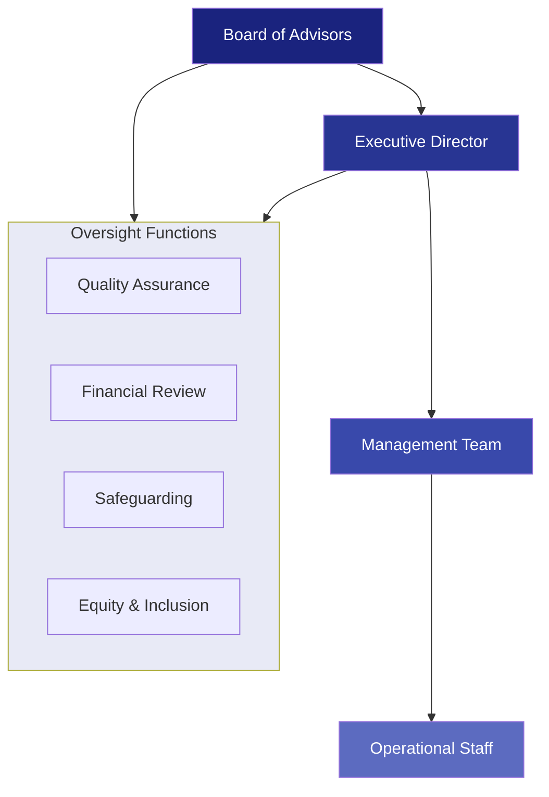

# APPENDIX L: ORGANIZATIONAL STRUCTURE

## Future Stars Academy — Team & Governance

---

## Organizational Chart

---

## Roles & Responsibilities

### 1. Founder & Executive Director

| Aspect | Detail |
|--------|--------|
| **Reports to** | Board of Advisors |
| **Type** | Full-time |
| **Year 1 Stipend** | M8,000/month (reinvesting surplus to increase) |
| **Key Responsibilities** | Strategic direction, partnership development, fundraising, governance, stakeholder relations, brand stewardship |

### 2. Programme Lead

| Aspect | Detail |
|--------|--------|
| **Reports to** | Executive Director |
| **Type** | Full-time |
| **Year 1 Salary** | M6,000/month |
| **Key Responsibilities** | Curriculum delivery, facilitator management, learner progress tracking, quality assurance, programme innovation |

### 3. ICT & Digital Lead

| Aspect | Detail |
|--------|--------|
| **Reports to** | Executive Director |
| **Type** | Part-time (50%) |
| **Year 1 Stipend** | M3,500/month |
| **Key Responsibilities** | ICT infrastructure, digital platform management, learner systems, tech support, digital curriculum content |

### 4. Admin & Finance Officer

| Aspect | Detail |
|--------|--------|
| **Reports to** | Executive Director |
| **Type** | Part-time (50%) |
| **Year 1 Stipend** | M3,000/month |
| **Key Responsibilities** | Enrolment management, fee collection, bookkeeping, procurement support, records management, reporting |

### 5. Facilitators (3 positions)

| Role | Focus Areas | Type | Stipend (M) |
|------|------------|:----:|:-----------:|
| Facilitator - AI & Coding | Python, AI fundamentals, web development, app development | Part-time (30%) | 2,500/month |
| Facilitator - Robotics & Engineering | Arduino, Raspberry Pi, 3D printing, electronics | Part-time (30%) | 2,500/month |
| Facilitator - Entrepreneurship & Vocational | Business creation, baking, fashion tech, leadership | Part-time (30%) | 2,500/month |

### 6. Support Roles

| Role | Focus | Type | Notes |
|------|-------|:----:|-------|
| Industry Mentors | Guest sessions, project guidance | Volunteer | 3-5 mentors from tech & business community |
| University Interns | Programme support, lab assistance | Part-time (20%) | Partnerships with NUL, LIT |
| Marketing Assistant | Social media, content creation | Part-time (20%) | M1,500/month |

---

## Year 1 Staff Cost Summary

| Role | Monthly (M) | Annual (M) |
|------|:----------:|:----------:|
| Executive Director | 8,000 | 96,000 |
| Programme Lead | 6,000 | 72,000 |
| ICT & Digital Lead (50%) | 3,500 | 42,000 |
| Admin & Finance (50%) | 3,000 | 36,000 |
| Facilitator - AI & Coding (30%) | 2,500 | 30,000 |
| Facilitator - Robotics (30%) | 2,500 | 30,000 |
| Facilitator - Entrepreneurship (30%) | 2,500 | 30,000 |
| Marketing Assistant (20%) | 1,500 | 18,000 |
| **TOTAL** | **29,500** | **354,000** |

*Note: Budgeted staff cost of M180,000 Year 1 reflects phased hiring and all staff starting from Month 4 onward.*

---

## Year 2 Expansion Team

---

## Board of Advisors (Proposed)

| Role | Expertise Sought | Status |
|------|------------------|:------:|
| Education Advisor | Curriculum development, pedagogy | To be recruited |
| Business/Finance Advisor | Financial management, fundraising | To be recruited |
| Technology Advisor | AI, software, digital transformation | To be recruited |
| Community/Youth Advisor | Youth development, community engagement | To be recruited |
| Legal Advisor | Governance, compliance | To be recruited |

---

## Staff Development Plan

| Activity | Frequency | Purpose | Budget (M/year) |
|----------|:---------:|---------|:---------------:|
| Weekly Team Meeting | Weekly | Coordination, planning | — |
| Monthly Training | Monthly | Skills development | 12,000 |
| Quarterly Retreat | Quarterly | Strategy, team building | 8,000 |
| External Training | As needed | Professional certification | 10,000 |
| Performance Review | Bi-annually | Growth, feedback | — |

---

## Governance Structure

---

*This organizational structure is designed for Year 1 operations and will evolve as the Academy grows. Regular role reviews will be conducted every 6 months.*
