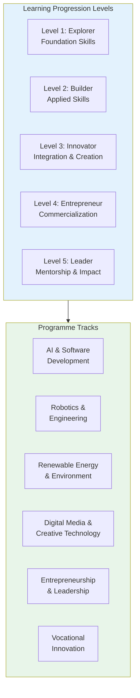
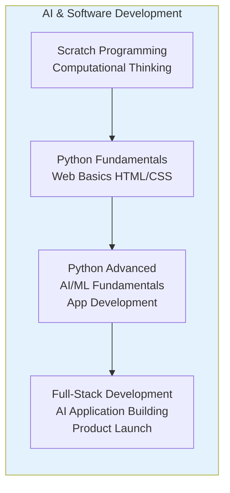
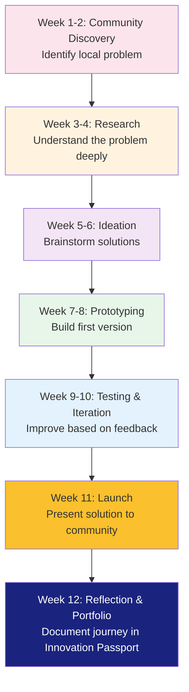

# APPENDIX M: CURRICULUM FRAMEWORK

## Future Stars Academy — Programme Architecture & Learning Pathways

---

## Curriculum Philosophy

Future Stars Academy's curriculum is built on **four core pillars**:

1. **Project-Based Learning** — Every topic culminates in a real product, prototype, or solution
2. **Problem-First Approach** — Start with a real community problem, learn skills to solve it
3. **Interdisciplinary Integration** — Technology, entrepreneurship, and vocational skills combined
4. **Progressive Mastery** — Learners advance through levels, earning Innovation Passport credentials

---

## Learning Pathway Architecture

---

## Learning Levels

### Level 1: Explorer (Ages 10-12 | Beginner)

| Duration | Focus | Key Skills | Output |
|:--------:|-------|------------|--------|
| 1 term (12 weeks) | Introduction to innovation and technology | Computational thinking, basic coding (Scratch), simple circuits, design thinking basics, teamwork | Simple animation, LED circuit, problem statement |

### Level 2: Builder (Ages 12-14 | Intermediate)

| Duration | Focus | Key Skills | Output |
|:--------:|-------|------------|--------|
| 2 terms (24 weeks) | Skill development and application | Python basics, Arduino fundamentals, 3D design, web basics, business model canvas | Working prototype, simple website, business concept |

### Level 3: Innovator (Ages 14-16 | Advanced)

| Duration | Focus | Key Skills | Output |
|:--------:|-------|------------|--------|
| 2 terms (24 weeks) | Integration and complex projects | AI/ML fundamentals, advanced robotics, IoT, app development, project management | Full prototype with AI/tech integration, project report |

### Level 4: Entrepreneur (Ages 16-18 | Pre-Professional)

| Duration | Focus | Key Skills | Output |
|:--------:|-------|------------|--------|
| 2 terms (24 weeks) | Commercialization and business creation | Startup creation, product development, marketing, financial management, pitching | Registered business, market-ready product |

### Level 5: Leader (Ages 16-18+ | Mastery)

| Duration | Focus | Key Skills | Output |
|:--------:|-------|------------|--------|
| Ongoing | Mentorship, community impact, advanced specialization | Teaching others, leading projects, community organizing, advanced special projects | Community project led, mentees trained, advanced portfolio |

---

## Programme Tracks Detail

### Track 1: AI & Software Development

| Level | Content | Tools | Project Example |
|:-----:|---------|-------|-----------------|
| 1 | Scratch, logic, sequences, loops | Scratch 3.0 | Interactive story about community issue |
| 2 | Python basics, HTML/CSS, databases | Python, VS Code | School homework tracker web app |
| 3 | OOP, APIs, AI concepts, mobile dev | Python, Flask, MIT App Inventor | AI-powered plant disease identifier |
| 4 | Full-stack, deployment, AI integration | React, Node.js, TensorFlow | Community marketplace app |

### Track 2: Robotics & Engineering

| Level | Content | Tools | Project Example |
|:-----:|---------|-------|-----------------|
| 1 | Simple circuits, motors, sensors | Arduino Starter Kit | Light-activated night light |
| 2 | Microcontrollers, programming, 3D design | Arduino, Tinkercad | Line-following robot |
| 3 | Advanced robotics, IoT, automation | Raspberry Pi, sensors | Smart irrigation system |
| 4 | System design, manufacturing basics | Advanced kits, 3D printer | Automated solar tracker |

### Track 3: Renewable Energy & Environment

| Level | Content | Tools | Project Example |
|:-----:|---------|-------|-----------------|
| 1 | Energy basics, types of renewable energy | Solar kits, measurement tools | Solar-powered phone charger |
| 2 | Solar PV, wind, energy efficiency | Multimeter, solar panels | Home energy audit tool |
| 3 | System design, battery storage, smart grids | Advanced solar kits | Community solar charging station |
| 4 | Project management, installation basics | Full system components | Off-grid classroom power system |

### Track 4: Digital Media & Creative Technology

| Level | Content | Tools | Project Example |
|:-----:|---------|-------|-----------------|
| 1 | Digital storytelling, graphic design basics | Canva, smartphones | Community awareness poster |
| 2 | Photography, video production, editing | OBS, DaVinci Resolve | Documentary about local issue |
| 3 | Animation, UI/UX design, social media strategy | Figma, Blender | Mobile app prototype for community |
| 4 | Content strategy, branding, monetization | Professional tools | Digital marketing campaign for student business |

### Track 5: Entrepreneurship & Leadership

| Level | Content | Tools | Project Example |
|:-----:|---------|-------|-----------------|
| 1 | Problem identification, teamwork, idea generation | Business Model Canvas | Community problem poster |
| 2 | Business model, customer discovery, budgeting | Lean Canvas, spreadsheets | One-page business plan |
| 3 | Marketing, financial management, pitching | Presentation tools, MVP framework | Pitch deck for student business |
| 4 | Business registration, operations, scaling | Legal templates, accounting | Registered student business |

### Track 6: Vocational Innovation

| Level | Content | Tools | Project Example |
|:-----:|---------|-------|-----------------|
| 1 | Basic baking, food safety, design thinking | Kitchen equipment | Innovation: healthy snack product |
| 2 | Advanced baking, costing, packaging | Commercial oven, broiler | Branded bakery product line |
| 3 | Fashion tech, sewing, wearable electronics | Sewing machine, LEDs | Smart fashion: LED-integrated garment |
| 4 | Production scaling, retail, e-commerce | Full kitchen/lab | Commercial product in local stores |

---

## Sample Learning Journey: From Problem to Product

---

## Skills Matrix by Level

| Skill Area | Explorer (L1) | Builder (L2) | Innovator (L3) | Entrepreneur (L4) |
|------------|:------------:|:-----------:|:--------------:|:-----------------:|
| Coding | Scratch | Python Basics | Python + APIs | Full-stack |
| Electronics | Simple circuits | Arduino | IoT + Sensors | System integration |
| Design Thinking | ✓ | ✓ | ✓ | ✓ |
| 3D Design | — | Basics | Advanced | Manufacturing |
| AI/ML | — | Concepts | Applied | Product integration |
| Business | Ideas | Canvas | Lean Startup | Registered business |
| Leadership | Teamwork | Lead small team | Project lead | Mentor others |
| Communication | Show & tell | Presentation | Pitch deck | Investor pitch |
| Community | Problem ID | Research | Solution design | Implementation |

---

## Innovation Passport Badges

| Category | Badges Available | Criteria |
|----------|:----------------:|----------|
| **Technical Skills** | 18 badges | Demonstrated proficiency in coding, electronics, robotics, AI |
| **Entrepreneurship** | 12 badges | Business creation milestones: idea, MVP, sales, registration |
| **Leadership** | 10 badges | Team leadership, mentorship, community organizing |
| **Innovation** | 15 badges | Project completion, patents, competition wins |
| **Community Impact** | 8 badges | Projects implemented, people reached, problems solved |
| **Vocational** | 10 badges | Skill mastery in baking, fashion, food technology |

---

## Curriculum Development Timeline

| Phase | Activity | Timeline |
|-------|----------|:--------:|
| Phase 1 | Core curriculum (Levels 1-2, all tracks) | Complete |
| Phase 2 | Advanced curriculum (Levels 3-4) | In development — complete by Month 6 |
| Phase 3 | Specialist modules (AI advanced, IoT pro) | Complete by Month 12 |
| Phase 4 | Adult/Professional curriculum | Complete by Month 18 |
| Phase 5 | Digital self-paced modules | Complete by Month 24 |

---

*The curriculum is reviewed annually and updated to reflect technological advancements, industry requirements, and learner feedback. All materials are designed to be culturally relevant and contextually appropriate for Lesotho.*
