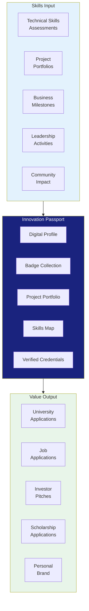
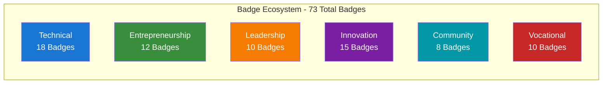
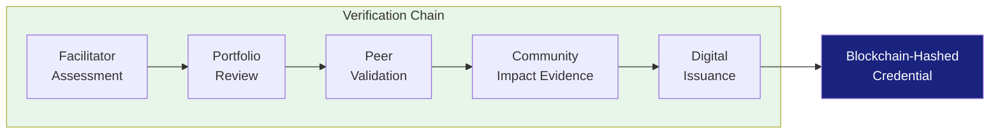

# APPENDIX N: INNOVATION PASSPORT OVERVIEW

## Future Stars Academy — Digital Skills Credentialing System

---

## What is the Innovation Passport?

The **Innovation Passport** is a digital credentialing system that records, verifies, and showcases each learner's practical skills, projects, and achievements throughout their journey at Future Stars Academy.

Unlike traditional report cards that measure academic performance, the Innovation Passport focuses on **demonstrated competencies**, **real-world projects**, and **entrepreneurial outcomes**.

---

## Passport Architecture

---

## Badge Categories

### Sample Badges

| Badge Name | Category | Level | Criteria |
|------------|:-------:|:-----:|----------|
| **Python Fundamentals** | Technical | Builder | Complete 3 Python projects with functions, loops, and data structures |
| **Circuit Master** | Technical | Explorer | Build 5 functioning circuits with multiple components |
| **AI Apprentice** | Technical | Innovator | Train and deploy a basic machine learning model |
| **MVP Launched** | Entrepreneurship | Innovator | Launch a minimum viable product with real users |
| **Business Registered** | Entrepreneurship | Entrepreneur | Register a business with relevant authorities |
| **First Sale** | Entrepreneurship | Entrepreneur | Generate first revenue from customer |
| **Team Captain** | Leadership | Explorer | Lead a team of 3+ on a project to completion |
| **Mentor** | Leadership | Leader | Mentor 2 junior learners through a full project cycle |
| **Community Solution** | Innovation | Innovator | Build and deploy a solution addressing a community problem |
| **Patent Ready** | Innovation | Entrepreneur | Document an original innovation with patent potential |
| **50 Lives Reached** | Community | Builder | Implement a project that positively impacts 50+ people |
| **Bakery Pro** | Vocational | Builder | Produce and sell 100+ units of a baked product |
| **Fashion Innovator** | Vocational | Innovator | Design and produce a wearable technology garment |

---

## Passport Verification System

### Verification Methods

| Method | Description | Trust Level |
|--------|-------------|:-----------:|
| Facilitator Assessment | Direct observation and rubric-based evaluation | High |
| Portfolio Review | Collection of project artifacts, code, and documentation | High |
| Peer Validation | Feedback from teammates and fellow learners | Medium |
| Community Evidence | Photos, testimonials, news coverage of projects | High |
| Digital Issuance | Secure, verifiable digital credential | Very High |

---

## Learner Journey Example

| Age | Duration | Level | Passport Content |
|:---:|:--------:|:-----:|------------------|
| 10 | Term 1 | Explorer L1 | Scratch animation, circuit project, teamwork badge |
| 11 | Term 1-2 | Explorer L2 | Python basics, first robot, design thinking badge |
| 12 | Terms 1-2 | Builder L1 | Web app, Arduino project, team captain badge |
| 13 | Terms 1-2 | Builder L2 | AI concepts, 3D printed prototype, community project |
| 14 | Terms 1-2 | Innovator L1 | ML model deployment, IoT project, business canvas |
| 15 | Terms 1-2 | Innovator L2 | Full-stack app, startup launch, first sale badge |
| 16 | Terms 1-2 | Entrepreneur L1 | Registered business, investor pitch, mentor badge |
| 17-18 | Ongoing | Entrepreneur L2 / Leader | Scaling business, leading community projects, mentoring juniors |

---

## Parent & Employer Access

| Stakeholder | View | Purpose |
|-------------|------|---------|
| **Learner** | Full passport | Personal portfolio, progress tracking |
| **Parent** | Progress dashboard | Monitor child's skill development |
| **School** | Summary report | Understand learner's enrichment activities |
| **Employer** | Verified credentials | Talent identification and recruitment |
| **Investor** | Project portfolio | Evaluate student ventures for investment |
| **University** | Skills map | Admissions consideration |

---

## Passport Technology Stack

| Component | Technology | Purpose |
|-----------|:----------:|---------|
| Digital Wallet | Mobile + Web App | Store and display badges |
| Verification | Blockchain hash | Tamper-proof credentials |
| Portfolio Hosting | Cloud Storage | Project artifacts and media |
| Skills Assessment | AI-Assisted | Automated skill verification |
| API Integration | REST API | Share with employers, universities |

---

## Competitive Advantage

| Feature | Innovation Passport | Traditional Report Card |
|---------|:------------------:|:----------------------:|
| **Focus** | Demonstrated skills | Academic knowledge |
| **Format** | Digital, interactive | Paper-based |
| **Verification** | Multi-source, blockchain | Single-source (teacher) |
| **Portability** | Mobile, shareable | School-locked |
| **Employer Value** | High (skills-based) | Low (grades-based) |
| **Update Frequency** | Real-time | Termly |
| **Personalization** | Individualized | Standardized |
| **Lifelong** | Yes (cumulative) | Per institution |

---

*The Innovation Passport is a key differentiator for Future Stars Academy and will be developed as a potential licensing product for other institutions in Years 3-5.*
