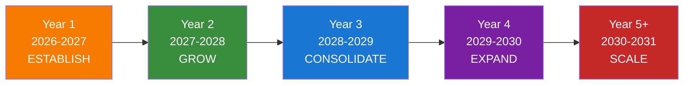
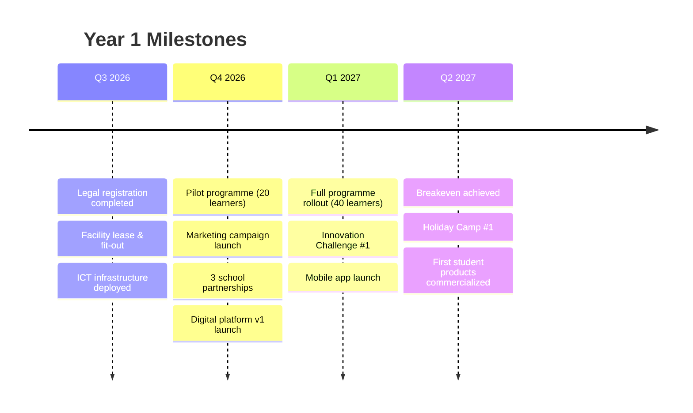
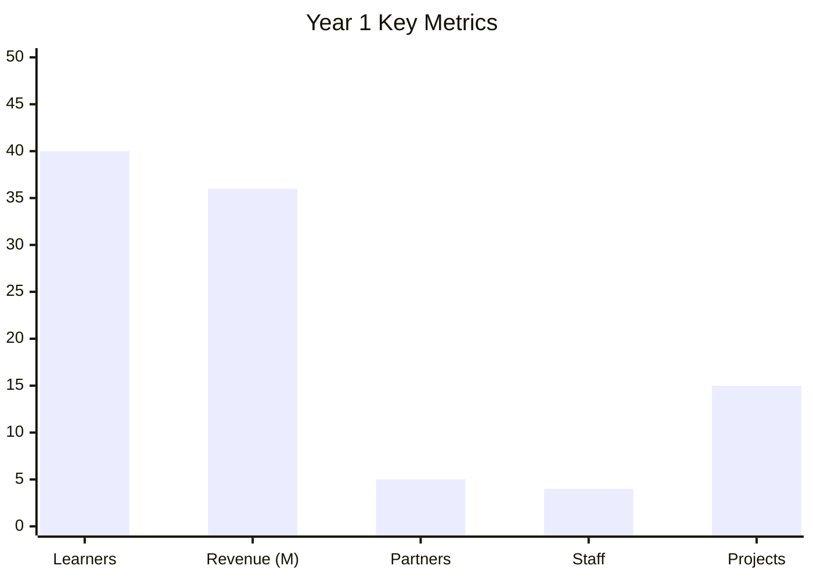
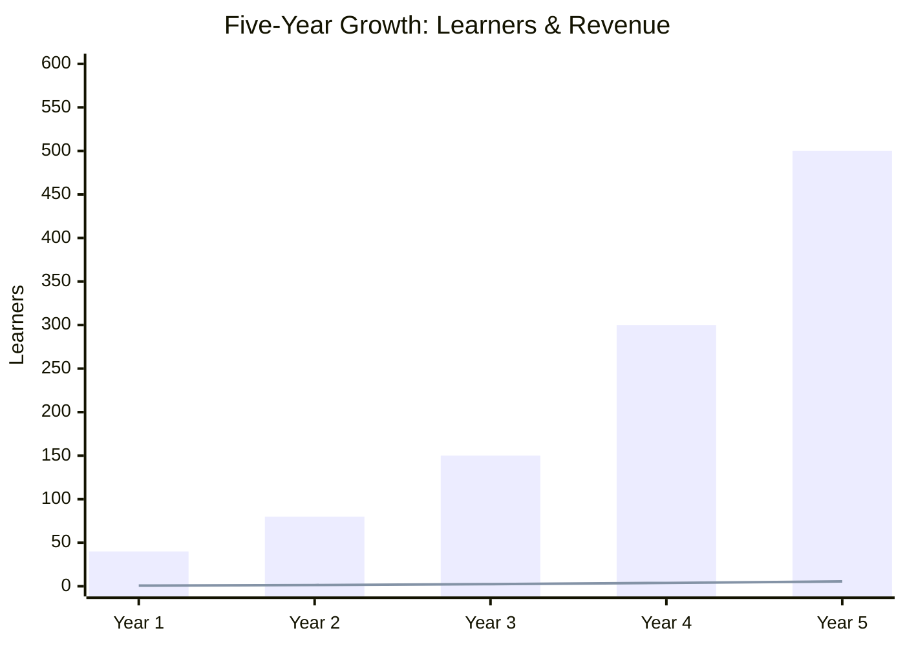

# APPENDIX O: FIVE-YEAR STRATEGIC ROADMAP

## Future Stars Academy — 2026 to 2031

---

## Strategic Vision

To transition Future Stars Academy from a **local after-school innovation programme** into a **nationally recognized innovation ecosystem** with regional influence across Southern Africa.

---

## Roadmap Overview

---

## Year 1: ESTABLISH (2026-2027)

**Theme:** *"Build the Foundation"*

### Strategic Objectives

| Objective | Target | Key Actions |
|-----------|:------:|-------------|
| Legal & Operational Setup | Complete | Register entity, secure facility, install infrastructure |
| Pilot Programme Launch | 20-40 learners | Recruit pilot cohort, deliver first programmes |
| Brand Establishment | Market awareness | Launch campaign, school partnerships, community events |
| Revenue Generation | M691,000 | Diversified revenue streams, grant applications |
| Team Building | 3-5 staff | Recruit core team, train facilitators |

### Key Milestones

### Success Metrics

---

## Year 2: GROW (2027-2028)

**Theme:** *"Scale Impact"*

### Strategic Objectives

| Objective | Target | Key Actions |
|-----------|:------:|-------------|
| Learner Growth | 80 learners | Expand school partnerships, add programmes |
| Geographic Reach | 2 districts | Pilot in second location, mobile innovation lab |
| Revenue Growth | M1.38M | Scale corporate training, consulting, digital platform |
| Programme Enhancement | 50% new content | AI, robotics advanced modules, new vocational streams |
| Partnership Expansion | 15 school partners | Formalize MOUs, teacher training programmes |

### Key Initiatives

- Launch **School Innovation Clubs** in 15 partner schools
- Introduce **Teacher Training Programme** for digital skills
- Launch **Mobile Innovation Unit** for rural outreach
- First **Annual Innovation Expo** with public showcase
- **Corporate Training** as a formal revenue division

---

## Year 3: CONSOLIDATE (2028-2029)

**Theme:** *"Build Sustainability"*

### Strategic Objectives

| Objective | Target | Key Actions |
|-----------|:------:|-------------|
| Learner Growth | 150 learners | Full capacity at main centre + outreach |
| Revenue | M2.4M | Diversify, increase non-fee revenue to 60% |
| Innovation Output | 30 student businesses | Accelerate incubation, seed funding partnerships |
| Digital Scale | 5,000 platform users | National online reach, AI companion live |
| Quality Assurance | ISO/certification | External quality audit, curriculum accreditation |

### Key Initiatives

- **Innovation Incubation Programme** with seed funding partners
- **Innovation Passport** recognized by employers and institutions
- **Curriculum Accreditation** by Ministry of Education
- **Franchise/Licensing Model** developed for replication
- **Alumni Network** established with mentorship programme

---

## Year 4: EXPAND (2029-2030)

**Theme:** *"Regional Reach"*

### Strategic Objectives

| Objective | Target | Key Actions |
|-----------|:------:|-------------|
| Learner Growth | 300+ learners | Multiple centres, franchise model |
| Geographic Reach | 5+ districts | Regional expansion in Lesotho |
| New Segments | Adult learners | Evening classes, professional certification |
| Product Commercialization | Student products to market | Retail partnerships, e-commerce platform |
| Ecosystem Role | Innovation hub recognition | Host national competitions, policy influence |

### Key Initiatives

- **Second Innovation Centre** in another district
- **Adult Learning Programme** (evening classes, weekend)
- **Innovation Passport Licensing** to other institutions
- **Student Product Marketplace** (physical + digital)
- **National Youth Innovation Competition** hosted annually

---

## Year 5+: SCALE (2030-2031)

**Theme:** *"Regional Leader"*

### Strategic Objectives

| Objective | Target | Key Actions |
|-----------|:------:|-------------|
| Learner Growth | 500+ learners | Multi-centre operations |
| Regional Reach | Southern Africa | Licensing in 1-2 neighbouring countries |
| Revenue | M5M+ | Diversified, sustainable, scalable |
| Social Enterprise | Self-sustaining | Grant independence achieved |
| Policy Influence | National education impact | Curriculum integration, government advisory |

### Key Initiatives

- **Regional Licensing** in South Africa, Eswatini, or Botswana
- **Future Stars Digital Ecosystem** as a SaaS platform
- **Foundation/Endowment** established for scholarships
- **Innovation Research Centre** producing thought leadership
- **Government Partnership** for national youth innovation policy

---

## Five-Year Growth Trajectory

---

## Cumulative Impact Projection

| Metric | Year 1 | Year 2 | Year 3 | Year 4 | Year 5 |
|--------|:------:|:------:|:------:|:------:|:------:|
| **Cumulative Learners** | 40 | 120 | 270 | 570 | 1,070 |
| **Cumulative Revenue (M)** | 0.69M | 2.08M | 4.48M | 8.28M | 13.78M |
| **Student Businesses** | 5 | 20 | 50 | 100 | 180 |
| **Community Projects** | 15 | 60 | 160 | 320 | 570 |
| **Jobs Created** | 5 | 25 | 75 | 175 | 350 |
| **Partner Schools** | 5 | 15 | 25 | 40 | 60 |
| **Innovation Centres** | 1 | 1 | 1 | 2 | 3+ |
| **Platform Users** | 500 | 2,500 | 7,500 | 15,000 | 30,000+ |

---

## Strategic Investment Needs by Phase

| Phase | Year | Capex Required (M) | Source |
|:-----:|:----:|:------------------:|--------|
| Establish | Y1 | 300,000 | Current investment ask |
| Grow | Y2 | 200,000 | Operating surplus + grant |
| Consolidate | Y3 | 350,000 | Surplus + development partner grants |
| Expand | Y4 | 500,000 | Surplus + impact investment |
| Scale | Y5+ | 1,000,000 | Mixed: surplus, investment, licensing |

---

## Key Strategic Assumptions

| Assumption | Basis | Risk Level |
|------------|-------|:----------:|
| Lesotho economy stable with moderate growth | IMF/World Bank projections | Medium |
| Government maintains focus on STEM education | National development plan alignment | Low |
| Donor funding for youth innovation continues | Global trends in youth-focused development | Medium |
| Internet penetration continues to increase | Telecom sector growth | Low |
| Parental willingness to invest in enrichment education | Growing middle class, demand evidence | Medium |

---

## Strategic Flexibility

The roadmap includes quarterly review points to assess:

1. **Market conditions** - Adjust pricing, targeting, or expansion pace
2. **Technology shifts** - Pivot curriculum or delivery model
3. **Funding landscape** - Accelerate or delay scale-up
4. **Competitive dynamics** - Differentiate or collaborate
5. **Policy environment** - Align with or advocate for change

---

*This roadmap should be reviewed annually, with detailed quarterly operational plans cascading from the strategic objectives.*
