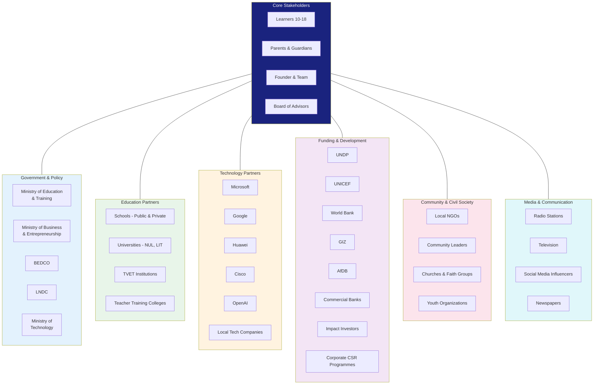
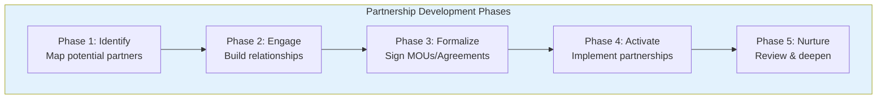

# APPENDIX P: STAKEHOLDER ECOSYSTEM MAP

## Future Stars Academy — Partnership & Stakeholder Architecture

---

## Ecosystem Overview



---

## Stakeholder Matrix

| Stakeholder | Interest | Influence | Engagement Strategy | Priority |
|-------------|:--------:|:---------:|---------------------|:--------:|
| **Learners** | Very High | High | Quality programmes, mentoring, Innovation Passport | Critical |
| **Parents** | High | High | Regular communication, open days, value demonstration | Critical |
| **Ministry of Education** | High | High | Alignment with national priorities, accreditation, reporting | High |
| **BEDCO** | High | High | Entrepreneurship support, incubation partnership | High |
| **Schools** | High | Medium | Innovation clubs, teacher training, shared resources | High |
| **Development Partners (UNDP, UNICEF, GIZ)** | Medium | High | Grant funding, technical assistance, scaling partnerships | High |
| **Technology Companies** | Medium | Medium | Equipment donations, software licenses, mentorship | Medium |
| **Commercial Banks** | Low | Medium | Funding, payment solutions, client referrals | Medium |
| **Local NGOs** | Medium | Low | Community access, referral partnerships | Medium |
| **Media** | Low | Medium | Coverage, awareness, event promotion | Medium |
| **Universities** | Medium | Low | Interns, research, curriculum input | Medium |
| **Corporate CSR** | Low | Medium | Sponsorship, employee volunteering | Low |

---

## Partnership Development Strategy



### Year 1 Partnership Targets

| Partner Type | Target | Status | Value |
|-------------|:------:|:------:|-------|
| Schools (public) | 3 | To engage | Learner pipeline, venue access |
| Schools (private) | 2 | To engage | Fee-paying learners |
| BEDCO | 1 | To engage | Incubation support, mentorship |
| Ministry of Education | 1 | To engage | Accreditation, policy alignment |
| Corporate Sponsor | 1 | To engage | Funding, equipment donations |
| NGO Partner | 1 | To engage | Community access, co-funding |
| University (Interns) | 1 | To engage | Interns, research support |
| Technology Company | 1 | To engage | Software donations, expertise |

---

## Value Exchange by Partner Type

### Schools

```
School --> Academy: Access to learners, venue space, credibility
Academy --> School: Enrichment programme, teacher training, reduced burden
```

### Government (MOET, BEDCO, LNDC)

```
Government --> Academy: Policy support, accreditation, funding access, referrals
Academy --> Government: Youth employment impact, innovation ecosystem, SDG contribution
```

### Development Partners (UNDP, UNICEF, GIZ, World Bank, AfDB)

```
Partner --> Academy: Grant funding, technical assistance, M&E support, network access
Academy --> Partner: Measurable impact, SDG alignment, community access, implementation capacity
```

### Technology Companies (Microsoft, Google, Huawei, etc.)

```
Partner --> Academy: Software donations, mentorship, platform access, certification programs
Academy --> Partner: Talent pipeline, CSR impact, brand association, market access (youth)
```

### Financial Institutions

```
Partner --> Academy: Funding, payment services, client referrals, financial literacy support
Academy --> Partner: CSR mandate fulfillment, new client acquisition (parents), community impact
```

### Community Organizations

```
Partner --> Academy: Local knowledge, community access, trust, volunteers
Academy --> Partner: Community projects, capacity building, youth engagement
```

---

## Partnership Management Process

| Step | Activity | Owner | Timeline |
|:----:|----------|:-----:|:--------:|
| 1 | Identify and research potential partners | Founder | Ongoing |
| 2 | Initial outreach and relationship building | Founder | 2-4 weeks |
| 3 | Proposal/Concept note submission | Founder | 1-2 weeks |
| 4 | Negotiation and alignment | Founder | 2-4 weeks |
| 5 | MOU/Agreement signing | Founder + Partner | 1-2 weeks |
| 6 | Implementation and reporting | Programme Lead | Ongoing |
| 7 | Quarterly review and relationship management | Founder | Quarterly |
| 8 | Annual partnership evaluation | Founder + Partner | Annually |

---

## Partnership Pipeline (Year 1)

| Quarter | Target | Activity |
|:-------:|--------|----------|
| Q3 2026 | 3 schools, MOET, BEDCO | Initial outreach, introductory meetings |
| Q4 2026 | 5 schools, 1 NGO, 1 tech co. | Formal proposals, MOUs signed |
| Q1 2027 | 2 more schools, 1 corporate | Activation of signed partnerships, new outreach |
| Q2 2027 | Partners for Year 2 | Review Year 1 partnerships, secure Year 2 commitments |

---

## Key Engagement Calendar

| Activity | Audience | Frequency |
|----------|----------|:---------:|
| School Principal Breakfast | School leaders | Quarterly |
| Partner Appreciation Event | All partners | Annually |
| Innovation Expo & Demo Day | All stakeholders | Annually |
| Parent Information Sessions | Parents | Termly |
| Community Innovation Forum | Community leaders | Quarterly |
| Government Roundtable | Ministry officials | Bi-annually |
| Donor/Investor Site Visit | Funders | As requested |

---

*This ecosystem map will be updated quarterly as partnerships develop. Each partner type has a dedicated engagement plan with clear KPIs and relationship owners.*
